<div align="center">

# GIORGIO

**An open, mobile two-armed service robot. It sorts, carries, docks to charge itself, and makes espresso.**

*We couldn't build the parts. So we bought them, and made them work together.*

[](LICENSE)
[](LICENSE-HARDWARE)
[](LICENSE-DOCS)
[](#status--honesty)
[](CONTRIBUTING.md)
[](https://github.com/VenetoStato/giorgio/actions/workflows/checks.yml)

<a href="https://github.com/VenetoStato/giorgio/releases/download/v0.1.0-design/giorgio_teaser.mp4">
  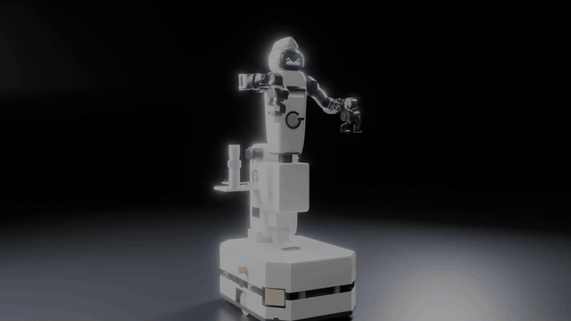
</a>

<sub>Simulation render. Click the GIF for the full 68 s teaser. <a href="#videos">More videos ↓</a></sub>

</div>

> [!IMPORTANT]
> **Work in progress: design and simulation only.** Giorgio has **not been built**. Many points are still open:
> type tests, CE certification, the choice of arms, real-hardware validation and more.
> See [Known gaps & open questions](#known-gaps--open-questions). Every number in this repository comes either from
> a manufacturer document or is marked as an estimate or an assumption. Help is very welcome.

Giorgio is a mobile bimanual service robot assembled from **open-hardware projects and certified off-the-shelf
components**:
- Enactic **OpenArm 2.0** arms;
- our own AMR base, built from a SICK, Pilz and ez-Wheel safety chain;
- an Orbbec depth camera and an NVIDIA Jetson.

The structure, shells, power system and software are our own. All of it is public: CAD, calculations, electrical and
safety design, a CE technical-file skeleton, a MuJoCo simulation of the whole robot, the robot software
(GIORGIO-OS) and reinforcement-learning training. Fork it, study it, improve it.

## Contents
[Start here](#start-here) · [What it does](#what-it-does) · [Videos](#videos) · [Architecture](#architecture) ·
[Repository map](#repository-map) · [Quick start](#quick-start) · [Bill of materials](#bill-of-materials) ·
[Customise](#customise-your-giorgio) · [Contribute](#how-to-contribute) · [Known gaps](#known-gaps--open-questions) ·
[Roadmap](#roadmap) · [Status & honesty](#status--honesty) · [Licence](#licence) · [Trademarks](#trademarks)

## Start here

| I want to… | Go to | Time |
|---|---|---|
| **Just look** | the [videos](#videos), the [AMR base datasheet](https://github.com/VenetoStato/giorgio/releases/download/v0.1.0-design/giorgio_amr_datasheet.html) (download it and open it in a browser), the renders in [`amr/renders/`](amr/renders/web) and the [bill of materials](docs/BOM_OVERVIEW.md) | 5 min |
| **Run the simulation** | [Quick start](#quick-start): `make setup && make sim` | 5–10 min |
| **Change the design** | [Customise your Giorgio](docs/CUSTOMIZE.md), then [CONTRIBUTING.md](CONTRIBUTING.md). Starter tasks are labelled [good first issue](https://github.com/VenetoStato/giorgio/labels/good%20first%20issue) | an evening |

Questions and ideas go to [Discussions](https://github.com/VenetoStato/giorgio/discussions). Some file and variable
names are still in Italian; the [glossary](docs/GLOSSARY.md) translates them.

## What it does

All clips are renders of the **MuJoCo simulation** (Blender 4.5 over recorded physics states), not footage of hardware.

<table>
<tr>
<td width="33%">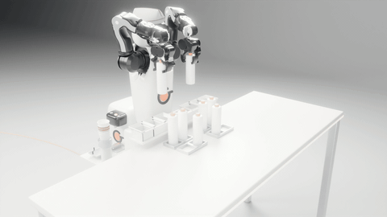<br><b>Kitting.</b> It loads its own tray and uses vision to insert the parts into the kit.</td>
<td width="33%">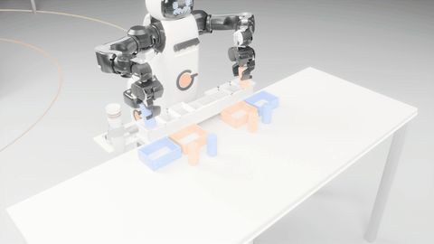<br><b>Sorting.</b> It sorts parts by colour with a clash-aware two-arm planner.</td>
<td width="33%">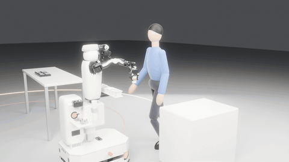<br><b>Coffee hand-over.</b> "Make me a coffee and bring it to Marco": it brews, drives and hands over the cup.</td>
</tr>
<tr>
<td>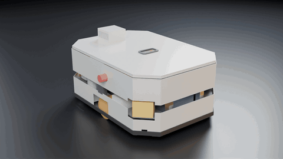<br><b>Own AMR base (rev B4).</b> 780 × 560 mm, turns on the spot, two ez-Wheel safety drives, two SICK nanoScan3.</td>
<td>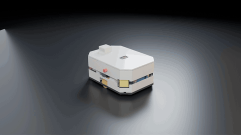<br><b>Every part, off the shelf or laser-cut.</b> 170 CAD parts, 0 interferences, power on the left and safety on the right.</td>
<td>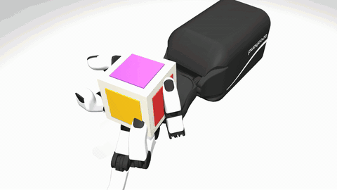<br><b>Learned skills.</b> An ORCA hand learns in-hand cube rotation with PPO on GPU (236 M steps in 81 min).</td>
</tr>
<tr>
<td>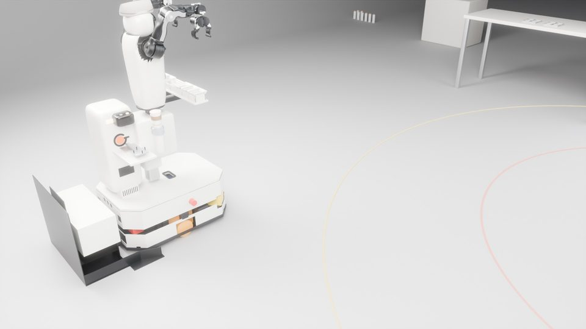<br><b>Auto-docking.</b> It goes home to charge on its own; the contacts stay dead until it is docked.</td>
<td>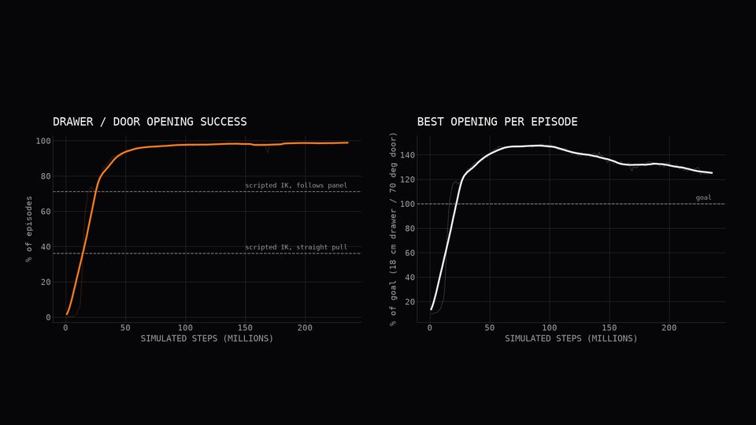<br><b>Drawers and doors.</b> A policy trained on a plain OpenArm runs unchanged on Giorgio: 90–95 % success, against 71–76 % for scripted IK.</td>
<td>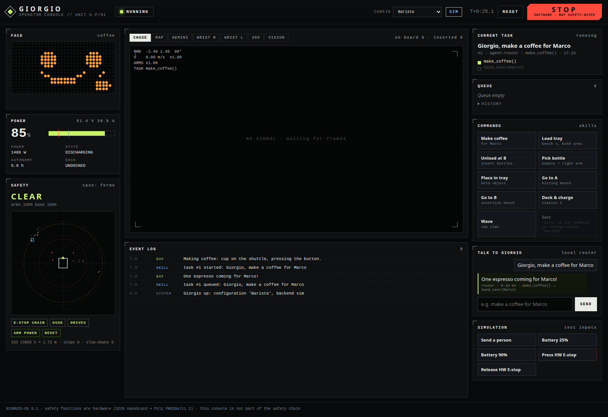<br><b>GIORGIO-OS console.</b> Chat, skills, a live energy budget and safety state, with the same code for sim and robot.</td>
</tr>
</table>

## Videos

Full-HD (1920×1080) videos of the simulation, attached to the
[v0.1.0-design release](https://github.com/VenetoStato/giorgio/releases/tag/v0.1.0-design) (CC BY 4.0):

| Video | Length | What you see |
|---|---|---|
| [Teaser](https://github.com/VenetoStato/giorgio/releases/download/v0.1.0-design/giorgio_teaser.mp4) | 1:08 | the whole idea in one minute |
| [Components](https://github.com/VenetoStato/giorgio/releases/download/v0.1.0-design/giorgio_components.mp4) | 0:57 | the parts and the own AMR base: exploded views, batteries, power and safety, the dock |
| [Activities](https://github.com/VenetoStato/giorgio/releases/download/v0.1.0-design/giorgio_activities.mp4) | 0:51 | loading the tray, vision-guided insertion, slowing down for people, sorting, going home to charge |
| [Training](https://github.com/VenetoStato/giorgio/releases/download/v0.1.0-design/giorgio_training.mp4) | 1:08 | an ORCA hand learns to turn a cube; an OpenArm learns drawers and doors, then runs on Giorgio |
| [Customisation](https://github.com/VenetoStato/giorgio/releases/download/v0.1.0-design/giorgio_customisation.mp4) | 1:06 | LED faces, hats, four setups (grippers, ORCA hands, budget hands, coffee module) |
| [Full film](https://github.com/VenetoStato/giorgio/releases/download/v0.1.0-design/giorgio_full.mp4) | 4:05 | everything above, in one cut |

The videos are built by [`render/video_series.py`](render/video_series.py). Vertical 9:16 cuts are still to do (see the
[issues](https://github.com/VenetoStato/giorgio/issues)).

## Architecture

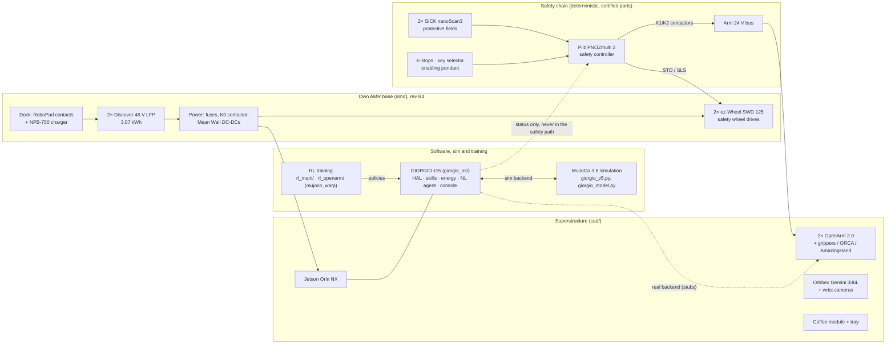

**Design rule:** every safety function runs on certified, deterministic hardware: scanners, a safety controller and
safety drives. No machine-learning model sits in the safety path, as the EU Machinery Regulation 2023/1230, Annex I
requires. Details: [`amr/electrical/`](amr/electrical) and [`amr/ce/`](amr/ce).

## Repository map

| Folder / file | What's there | Status | Main entry point |
|---|---|---|---|
| [`amr/`](amr/README.md) | **Own mobile base**:<br>• CAD (170 parts) and calculations<br>• electrical + safety package<br>• CE file skeleton<br>• industrialisation plan and certainty audit | design rev B4, checks pass | `amr/amr_cad.py`, `amr/amr_calc.py`, `amr/electrical/check_amr.py` |
| [`cad/`](cad/README.md) | Superstructure CAD (CadQuery):<br>• parts and bolted joints<br>• validator<br>• STEP/STL exports | design; base-adapter parts belong to an earlier base variant | `cad/validate.py` → `cad/VALIDATION.md` |
| [`electrical/`](electrical/README.md) | Superstructure power and safety design, netlists, BOM generator | design; base variants archived | `electrical/calc.py`, `electrical/make_bom.py` |
| `giorgio_v5.py`, `giorgio_model.py`, … (root) | **MuJoCo simulation**:<br>• robot model (official OpenArm MJCF + own base)<br>• missions, IK, vision<br>• people, energy, docking | working in sim | `giorgio_v5.py` (`make sim`) |
| [`giorgio_os/`](giorgio_os/README.md) | **Robot software**:<br>• HAL (sim + real stubs), skills<br>• safety supervisor, energy and mission managers<br>• NL agent, web console | sim backend works; real backend stubs | `python -m giorgio_os.sim_server` (`make console`) |
| [`rl_mani/`](rl_mani/README_IT.md) | RL: ORCA hand in-hand cube rotation (PPO, mujoco_warp) | trained policy included | `rl_mani/train.py` |
| [`rl_openarm/`](rl_openarm/README.md) | RL: OpenArm lift and drawer/door policies, transferred unchanged to Giorgio | trained policies included | `rl_openarm/train.py`, `rl_openarm/run_cpu.py` |
| [`verifiche/`](verifiche) | Simulation checks: docking, arm collisions, shells, box forces | working | `verifiche/aggancio.py`, `verifiche/urti.py` |
| [`render/`](render) | Blender 4.5 render pipeline, LED faces, hats, music, video editing | working (needs Blender) | `render/video_series.py`, `render/run_v19.sh` |
| [`assets/`](assets/shells), [`robots/`](robots) | Shell meshes (OBJ) and arm URDFs | data | `shells.py` |
| [`docs/`](docs) | [BOM overview](docs/BOM_OVERVIEW.md), [customising](docs/CUSTOMIZE.md), [glossary](docs/GLOSSARY.md), base decision, power & certification notes, [Italian summary](docs/README_IT.md) | docs | — |
| [`FEASIBILITY.md`](FEASIBILITY.md) | SDK, driver and licence check for every component, plus the top risks | docs | — |
| [`kickstarter/`](kickstarter), [`launch/`](launch) | Campaign and launch drafts (IT/EN) | drafts | — |
| [`scripts/`](scripts) | `setup.sh`, `fetch_third_party.sh`, `bom_overview.py` | working | `make setup` |
| [`legacy/`](legacy/README.md) | One-off and superseded scripts, kept for history | unmaintained | — |
| `third_party/` (not committed) | OpenArm MJCF, ORCA, AmazingHand, LEAP models at pinned commits | fetched | `scripts/fetch_third_party.sh` |

## Quick start

Tested on Ubuntu 24.04 with Python 3.12. You need git, Python ≥ 3.10 with `venv`, and about 1.5 GB of disk. The
optional parts need more: a GPU for training, Blender 4.5 for renders, and a separate environment for the CAD.

```bash
git clone https://github.com/VenetoStato/giorgio.git && cd giorgio
make setup        # .venv + requirements.txt (MuJoCo 3.8, ...) + third_party/ at pinned commits
make sim          # GUI simulation: the logistics mission (needs a display)
make coffee       # GUI: "Giorgio, make me a coffee and bring it to Marco"
make console      # GIORGIO-OS operator console → http://127.0.0.1:8080
make check        # fast checks, the same as CI (AMR electrical/safety + calculations, syntax)
```

<details>
<summary>Without make (manual steps), headless servers, CAD, renders and training</summary>

```bash
# 1. simulation environment (Debian/Ubuntu: sudo apt install python3-venv git)
python3 -m venv .venv && . .venv/bin/activate
pip install -r requirements.txt && pip install --no-deps -e giorgio_os
scripts/fetch_third_party.sh                       # ~400 MB; --minimal = OpenArm only (~30 MB)

# 2. run
MUJOCO_GL=egl PYTHONPATH=. python giorgio_v5.py                                  # GUI
MUJOCO_GL=egl PYTHONPATH=. python giorgio_v5.py --seconds 40 --video video/sim.mp4   # headless → mp4
MUJOCO_GL=egl python -m giorgio_os.sim_server                                     # console
(cd giorgio_os && MUJOCO_GL=egl python -m pytest -q)                              # tests

# 3. checks of the base (PyYAML + numpy only)
python amr/electrical/check_amr.py                 # 242 PASS / 0 FAIL / 11 OPEN
(cd amr && python amr_calc.py)                     # writes amr/CALC.md

# 4. CAD (separate env, ~2 GB): see cad/README.md
python3.11 -m venv cad/.env && cad/.env/bin/pip install -r cad/requirements.txt
make cad-validate && make amr-cad

# 5. renders (Blender 4.5 on PATH or BLENDER=/path/to/blender)
make render-amr

# 6. GPU training (separate env, Python 3.11, NVIDIA GPU): see rl_openarm/README.md, rl_mani/README_IT.md
pip install torch && pip install -r requirements-train.txt
cd rl_openarm && python train.py --task cabinet --envs 4096 --max_minutes 95 --out runs/cX
```
Environment variables: `PYTHON` (interpreter for `make` and `setup.sh`), `CADPY` (CAD env), `BLENDER` (Blender binary),
`MUJOCO_GL=egl` (headless rendering, the default in `make`).
</details>

## Bill of materials

The full robot, grouped by subsystem with part numbers, sources and status, is in **[docs/BOM_OVERVIEW.md](docs/BOM_OVERVIEW.md)**.
It is generated by [`scripts/bom_overview.py`](scripts/bom_overview.py) from [`amr/bom_amr.csv`](amr/bom_amr.csv) and
[`docs/bom.csv`](docs/bom.csv). Component costs only: EUR excluding VAT, prototype quantity 1, no labour.

| Subsystem | Main parts | EUR |
|---|---|---:|
| Base AMR | 2× ez-Wheel SWD 125, laser-cut/bent steel and aluminium frame, sprung castors, covers | 8,317 |
| Safety | 2× SICK nanoScan3 Pro I/O, Pilz PNOZmulti 2 (B0 + 3 × EF 4DI4DOR), contactors, e-stops, pendant | 8,919 |
| Power | 2× Discover DLP-GC2-48V LFP, fuses, main contactor, Mean Well DC-DCs, harnesses | 4,855 |
| Dock | RoboPad contacts, Mean Well NPB-750-48 charger, dock controller | 2,171 |
| Arms & hands | Enactic OpenArm 2.0 bimanual kit (arms, torso, grippers, wrist cameras) + arm power | 6,959 |
| Vision & compute | Jetson Orin NX (reComputer J4012), Orbbec Gemini 336L, fisheye cameras, LED face | 2,335 |
| Structure & shells | column, brackets, tray, PA12 shells, fasteners | 1,476 |
| Coffee module | 24 V capsule machine, cup shuttle, coffee power | 1,025 |
| **Total (barista configuration)** | 171 rows; 67 % of the value from documented prices, the rest are estimates waiting for quotes | **36,056** |

## Customise your Giorgio

Giorgio is meant to be remixed. [docs/CUSTOMIZE.md](docs/CUSTOMIZE.md) explains how to:
- change the base dimensions ([`amr/amr_params.py`](amr/amr_params.py));
- swap the arms or hands (gripper / ORCA / AmazingHand / LEAP);
- change the LED face, hats, tray and coffee module;
- re-run the checks and renders;
- re-train a skill.

## How to contribute

1. Look at the [good first issues](https://github.com/VenetoStato/giorgio/labels/good%20first%20issue) or
   [help wanted](https://github.com/VenetoStato/giorgio/labels/help%20wanted), or open an issue/discussion with your idea.
2. Fork, create a branch, change things, and run `make check` plus the checks of the area you touched.
3. Open a pull request. The template asks for the check results and the sources of any technical value.

Rules that matter:
- Every purchased-part value needs an official source, tagged SOURCED / SECONDARY / ESTIMATE / ASSUMED.
- Safety stays deterministic and certified.
- No manufacturer PDFs in git.

The details are in [CONTRIBUTING.md](CONTRIBUTING.md). Please follow the [Code of Conduct](CODE_OF_CONDUCT.md).
Security or safety-design concerns go through [SECURITY.md](SECURITY.md).

## Known gaps & open questions

What is **not** done or not certain yet. Each item has its source:
- **Arms decision** (owner). OpenArm 2.0 is open and cheap, but it has no brakes, no STO and no safety-rated
  speed/force. That makes it non-collaborative: no certified hand-to-hand hand-over and no CE as-is (gap G1 in
  [`amr/ce/GAPS.md`](amr/ce/GAPS.md)). The alternative is a certified cobot on 48 V DC (variant "C48": UR e-Series /
  Kassow), or a brake retrofit of OpenArm.
- **CE gaps** ([`amr/ce/GAPS.md`](amr/ce/GAPS.md)):
  - safety requirements spec and PL calculations (SISTEMA) not written;
  - coffee machine without a DoC or food-contact declaration;
  - Wi-Fi module and EN 18031 not done;
  - supervisory function and safety logging not implemented;
  - producer registrations not done;
  - the SS1-t ramp-failure residual is open.
- **Type tests TP-01…TP-23** are planned but not run ([`amr/ce/TEST_PLAN.md`](amr/ce/TEST_PLAN.md)). They cover stopping
  distances, personnel detection, EMC, short-circuit current (TP-14) and payload.
- **Certainty audit** ([`amr/CERTAINTY.md`](amr/CERTAINTY.md)). Of the 82 BOM rows, 32 have only a price and need a
  quote, and 1 is a gap. Of the calculation inputs, 2 are gaps (gripper length, coffee machine power) and 28 wait for
  type tests. In the netlist, the battery short-circuit current is unpublished, which leaves 11 OPEN rows.
- **Documents still to fetch or buy** ([`amr/DOWNLOAD_LIST.md`](amr/DOWNLOAD_LIST.md)): the Pilz certificate, the
  Discover UN 38.3 summary, EN 60204-1 / DIN VDE 0298-4, and EN ISO 3691-4.
- **Purchased-part interfaces** in the CAD are partly datasheet envelopes or ASSUMED holes, not vendor STEP files
  ([`cad/VALIDATION.md`](cad/VALIDATION.md)). The superstructure CAD in `cad/` still carries adapter parts of an earlier
  base variant.
- **Software**:
  - the ROS 2 node and launch files are not written;
  - the real-hardware backend of GIORGIO-OS is stubs;
  - 4 of the 29 GIORGIO-OS tests (sim skills: pick into tray, auto-dock, safety stop, chat navigation) have failed
    since the switch to the rev B base;
  - the Claude planner is untested against the live API.
- **Sim ↔ CAD drift**: part of the base geometry in `giorgio_model.py` (castors, wheels) is typed by hand and differs
  slightly from `amr/amr_params.py` (see [docs/CUSTOMIZE.md](docs/CUSTOMIZE.md)).
- **Sim-to-real**: the RL policies use privileged simulator state for the object pose. Nothing has run on hardware.
- **Media**: vertical 9:16 cuts for social media are missing.

## Roadmap

1. **Decide the arms** (OpenArm R&D variant vs a certified 48 V cobot) and freeze the superstructure on the rev B4 base.
2. **Prototype**: buy the long-lead parts (ez-Wheel, nanoScan3, PNOZ, batteries), build the base, and bring up the
   safety chain on the bench.
3. **CE type tests** TP-01…TP-23 with an Italian lab, the SISTEMA PL calculations and the technical file.
4. **ROS 2 bring-up**: base driver, scanners, Nav2 with the docking server, OpenArm `ros2_control`, and the GIORGIO-OS
   real backend.
5. **Skills on hardware**: teleoperation data, then imitation / RL fine-tuning; validate the policies sim-to-real.
6. **Community**: vertical videos, translations, a web CAD viewer, more hands and modules.

## Status & honesty

| | Simulated / designed | Verified on hardware |
|---|---|---|
| Mechanics (CAD, interferences, tipping, bolt loads) | yes: CadQuery + checks | no |
| Electrical and safety design (fuses, contactors, PL targets) | yes: netlists + 242 automated checks | no |
| Robot behaviour (kitting, sorting, coffee, docking) | yes: MuJoCo 3.8 with official arm models | no |
| Learned skills (cube rotation, lift, drawers/doors) | yes: GPU PPO, evaluated on 50–100 episodes | no |
| Purchased-part data | from manufacturer documents where tagged SOURCED; otherwise marked | n/a |
| Prices | 67 % documented, the rest estimates | no quotes yet |

The renders and videos show the simulation. Where a value is an estimate, the file says so. If you find a number
that is wrong or unsourced, please [open an issue](https://github.com/VenetoStato/giorgio/issues/new/choose).

## Licence

- Software: [Apache-2.0](LICENSE).
- Hardware and CAD: [CERN-OHL-S-2.0](LICENSE-HARDWARE).
- Documents, renders and videos: [CC BY 4.0](LICENSE-DOCS).

Third-party models keep their own licences and are not redistributed here (see [NOTICE.md](NOTICE.md)):
- OpenArm: Apache-2.0;
- ORCA Hand: CC BY 4.0 (description MIT);
- AmazingHand: CC BY 4.0 / Apache-2.0;
- MuJoCo Menagerie LEAP hand: per its own licence.

## Trademarks

Giorgio is an independent design concept, not affiliated with, sponsored or endorsed by any company named here.
Component names are used only to identify compatible parts. OpenArm is a project of Enactic, Inc. SICK and nanoScan3
are trademarks of SICK AG. Pilz and PNOZ are trademarks of Pilz GmbH & Co. KG. NVIDIA and Jetson are trademarks of
NVIDIA Corporation. Orbbec and Gemini are trademarks of Orbbec. ORCA Hand is a trademark of ORCA Dexterity, Inc.
AmazingHand is a project of Pollen Robotics. **Ferrari** is a trademark of Ferrari S.p.A. **Fiat** and **Panda** are
trademarks of FCA Italy S.p.A. (Stellantis). The teaser line *"Not a Ferrari. A Fiat Panda."* uses them only as a
comparison. All other names are trademarks of their respective owners. See [NOTICE.md](NOTICE.md).
