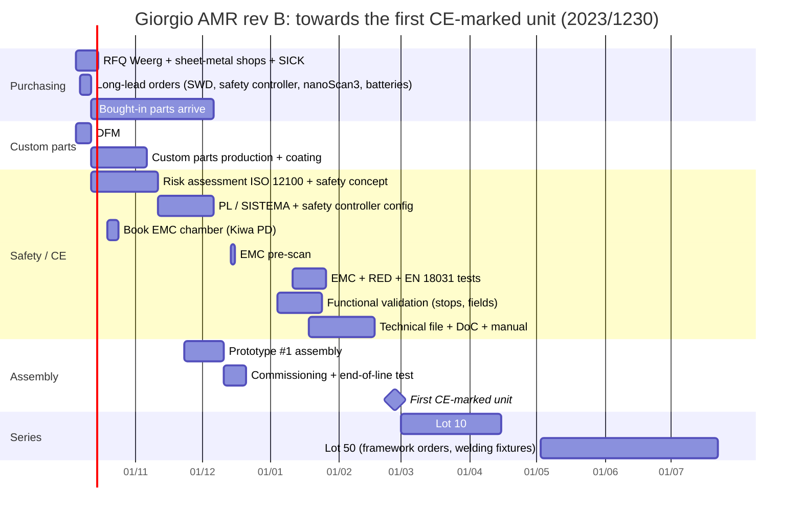

# Giorgio + own AMR: industrialisation plan in Italy (lots 1 / 10 / 50), rev B3

Date: 2026-10-05. Design **rev B**: no waist yaw joint, the top deck is the superstructure flange (z 353 mm), 2 SICK
nanoScan3 kept. Replaces `INDUSTRIALIZZAZIONE.md` (rev A, Italian). References: `CONTEXT.md`, `out/parts.json`,
`docs/bom.csv`, `docs/BASE_DECISION_2026-10-05.md`, `electrical/`. Line-item BOM: **`bom_amr.csv`** (same names as `parts.json`).

**Tags.** **SOURCED** = manufacturer page or official source (URL). **SECONDARY** = distributor or third-party page (URL).
**ESTIMATE** = our market estimate, to be replaced by a quote. Prices in EUR, excl. VAT and shipping.

> **Research limit.** The web-search budget was exhausted; only known pages were read (WebFetch). Few Italian suppliers
> publish prices: sheet-metal shops, coaters, EMC labs and consultants all work on quotation. **ESTIMATE figures are
> orders of magnitude**; turning them into quotes is the first operational step (§8).

---

## 0. Executive summary

> Scanner price check (2026-10-05): the VB Steuerungstechnik price €2,394.95 is **excl.** 19 % VAT (verified on the dealer page). All totals use it.

| All values ESTIMATE (built from SECONDARY/ESTIMATE rows, §5) | @1 (prototype) | @10 | @50 |
|---|---|---|---|
| **AMR alone, incl. dock**: materials + assembly | **€26.1k** | **€21.9k** | **€19.2k** |
| + NRE/CE share (€45k spread over the lot) | €71.1k | €26.4k | €20.1k |
| **Giorgio R&D (OpenArm)**: materials + assembly | €38.6k | €33.2k | €29.5k |
| + NRE/CE share (€60k) | **€98.6k** | **€39.2k** | **€30.7k** |
| **Giorgio with certified arms**: materials + assembly | €92.0k | €82.5k | €75.1k |
| + NRE/CE share (€70k) | **€162.0k** | **€89.5k** | **€76.5k** |

**Rev B4 (2026-10-05, `CAD_REV_B4.md`, `CERTAINTY.md`): AMR incl. dock materials €24,331 / €20,822 / €18,472 (+€1,056 @1 vs rev B3).** Main changes: public prices replace ESTIMATEs (Siemens 3RT2026 €202.10 × 2, PEAK IPEH-004010 €294, DDR-240 €134.08, DUB01 €144.90 × 2, DDR-120/60, DRDN40, NPB-750, FL SWITCH, KI4, E-stop, Eaton M22, Mersen HP10M), SR3 PNOZ m EF 4DI4DOR (€379.72, SLS[2] band) + terminal set, SWD tunnels E43 + 2 tunnel fans, deck doubler A09, bracket A10, cheek plates, K06 cover row, enabling pendant €500 (quote). Jetson = Seeed reComputer J4012 (€1,287, superstructure).

**Rev B3 (2026-10-05, `CAD_REV_B3.md`): +€385 @1, +€363 @10, +€350 @50 on the AMR incl. dock.**

| Change | €/robot @1 | Tag |
|---|---|---|
| Castor suspension (`CASTOR_SUSPENSION.md`): 4 × Blickle L-ALST 80K + 4 × HIWIN MGN15R L190 + 8 × MGN15H + 8 × Gutekunst D-313J-02 + 4 carriage weldments + 4 spring brackets + pads, buffers, fasteners, replacing the rev B2 placeholder (L-ALST 100K + own slide + D-350) | +369 | castor/rail/block prices **QUOTE** (not published by Blickle/HIWIN; ESTIMATE values in the totals), springs SOURCED (federnshop.com), weldments ESTIMATE |
| Tower roofs without legs (−€160), brackets A06/A07/A08 (+€100), 3 posts instead of 4 (−€25), LYNK bracket E38b (+€25), 10 DIN rail pieces (+€10) | −50 | ESTIMATE |
| P10 tray, P11 shelf and the centre intake fan deleted (rev B2 CAD), 2 × 40 mm gap fans added | −80 | ESTIMATE |
| K0V and dock XD3 = Carlo Gavazzi DUB01CD48500V (DigiKey USD 177.65 → €163 each, was €90 ESTIMATE) | +146 (2) | SECONDARY (datasheet SOURCED) |

**Rev B2 (2026-10-05, design changes of `VERIFICATION.md`): +€623 @1, +€495 @10, +€441 @50 on the AMR incl. dock.**

| Change | €/robot @1 | Tag |
|---|---|---|
| + 2 × Pilz PNOZ m EF 4DI4DOR 772143 (relay interface for SWD STO/INSafe + scanner inputs) | +759.44 | SECONDARY (eibabo €379.72 net) |
| − Pilz PNOZ m EF 8DI4DO (SX1, no longer needed) | −321.86 | SECONDARY |
| + 7 bleed resistors 2.2 kΩ in component terminals | +28 | ESTIMATE |
| + KI4 interposing relay (Phoenix PLC-RSC) for the K4 coil | +20 | ESTIMATE |
| + K0V 48 V low-voltage cut-off relay | +90 | ESTIMATE |
| + coil suppression set (K0 diode, K1/K2 diode/Zener) | +40 | ESTIMATE |
| E-stops: Eaton M22 (€80, incl. plates) → Siemens 3SU1 + 2 × 3SU1400-1AA10-1CA0 (€55) | −50 (2 base) | ESTIMATE |
| Castors: spring castor D100 (€110, no P/N) → Blickle L-ALST 100K + own slide + Gutekunst D-350 (€45 + €80 + €2) | +68 (4) | ESTIMATE, pending the castor stream |
| Dock: NPB-1700-48 (€290) → NPB-750-48 (€190, Class B); + 59 V OV relay XD3 (€90) | −10 | ESTIMATE |

Corrected order codes (no price effect): SW80B…A (24 V continuous coil), ED250B-L, F0 3NA3830 NH000, system plug
NANSX-AAACZZZZ1 (2105107, now SOURCED), RoboPad RPCOL90-100 (no wireless CAN), DDR-60L-5 52.5 mm, LYNK II 120 × 135 × 44.

Rev B safety controller (2026-10-05, `electrical/ELECTRICAL.md` §6, §B2.1): **Pilz PNOZmulti 2**; rev B1 was PNOZ m B0 +
EF 8DI4DO + ES ETH (€1,374.87), rev B2 is B0 + 2 × EF 4DI4DOR + ES ETH (€1,812.45 SECONDARY) + terminal sets €90 ESTIMATE. The rev B DIN items (K0T,
WF1–3, U5, KS, centre-bay rails and modules, centre intake fan) are now in `bom_amr.csv`. Net effect vs the placeholder
BOM: −€0.2k @1, −€0.1k @10, +€0.02k @50 on the AMR; the coffee DC-DC + relay moved from the superstructure list into the
base centre bay (`bom_amr.csv` group `barista`, €226 incl. the FCF fuse, was €165 in the superstructure list).

Rev A for comparison (AMR incl. dock, waist and Jetson): €30.9k / €25.7k / €21.9k.

- **What changed from rev A.** All waist items are gone: ACTILINK-JP25 (€1,618), THK RU124 (€350), igus twisterband
  (€300), actuator ring, coupling hub, waist plate, deck guard disc, skirt shell (≈ €1.65k @1 of custom parts),
  MOC1 waist encoder and waist limit switches. The nanoScan3 now uses a verified German distributor price (−€4k per robot).
  The Jetson moved out of the AMR total (it is superstructure compute). Added: centre tray/shelf, deck grommet, 4 fans,
  rear-panel devices, the full DIN module list from `parts.json` and `electrical/` rev B1, and the Pilz safety controller.
- **Cost is dominated by a few certified bought-in components** (@1, per robot):
  - 2 ez-Wheel SWD 125: €4,666 (SECONDARY);
  - 2 nanoScan3 Pro I/O: €4,790 (€2,394.95 each, excl. 19 % VAT, verified on the dealer page 2026-10-05, SECONDARY) + 2 system plugs NANSX-AAACZZZZ1
    (2105107, P/N SOURCED) €531 (SECONDARY eibabo);
  - safety controller Pilz PNOZmulti 2 rev B2: €1,902 (B0 + 2 × EF 4DI4DOR + ES ETH €1,812.45 SECONDARY + €90 terminals ESTIMATE);
  - 2 batteries: €1,860 (ESTIMATE from USD SECONDARY).

  Together **≈ €12.9k of €21.3k** of AMR base materials. Custom parts are only ≈ €1.9k @1 and ≈ €0.6k @50.
- **Versus buying a base (§5.4):** from @1 the own AMR is at or below the Poseidon path and clearly below RB-THERON
  for the same content (safety, power, dock).
- **Key date:** Machinery Regulation (EU) 2023/1230 applies from **20 Jan 2027**. A CE unit before then is not realistic
  (about 20 weeks needed, some parts on backorder). Design and mark **directly to 2023/1230**, first CE-marked unit
  **late February / early March 2027** (§6).

---

## 1. Custom parts (make)

### 1.1 Recommended suppliers (Veneto, closest to Venice/Treviso first)

| Process | Supplier | Evidence | Lead time |
|---|---|---|---|
| **5-axis CNC + turning** (6082, S355J2) | **Weerg**, Via Campocroce 14, **Scorzè (VE)** | Instant online quote; first order: €500 off 3D printing and −20 % on CNC; ISO 9001. SOURCED https://www.weerg.com/it/ , https://www.weerg.com/it/lavorazioni-cnc-online | from 3 working days + 2 days shipping (SOURCED) |
| Laser cutting **5754 / stainless / pickled steel** (not S355MC, no bending) | Weerg | SOURCED https://www.weerg.com/it/taglio-laser | from 3 days |
| Laser + **bending** + tapping, online only | LaserBoost (ES) | 0.5–15 mm, bending up to 3 m, from 1 piece. SOURCED https://www.laserboost.com/en/ | ships in 72 h |
| Laser **S355MC** + bending + **welding** (castor towers, dock frame) | **Local sheet-metal shop TV/PD** (2–3 quotes; Kompass list below) | No online service does welding + S355MC + powder coating | 2–4 weeks (ESTIMATE) |
| Waterjet 10 mm 6082 plates + CNC finishing | Veneto waterjet/CNC shop, or all at Weerg as a milled part | – | 2–4 weeks (ESTIMATE) |
| Powder coating RAL 9016 | Local coater TV/PD | minimum €50–150 per batch (ESTIMATE) | 5–10 working days (ESTIMATE) |

Veneto contract assembly / sheet-metal companies (SECONDARY):
https://it.kompass.com/a/assemblaggi-meccanici-per-conto-terzi/65930/r/veneto/it_05/

**Closed issue: the `W10_skirt_shell` no longer exists.** Rev A found that the skirt half (537 × 268 × 113 mm) did not fit
the MJF build volume of 380 × 284 × 380 mm (SOURCED https://www.protolabs.com/it-it/servizi/stampa-3d/multi-jet-fusion/).
Rev B has no waist, hence no skirt: no MJF part remains in the AMR.

### 1.2 Price indicators used (all ESTIMATE, Veneto 2026)

| Item | Value |
|---|---|
| S355MC sheet | €0.90–1.20/kg |
| 6082-T6 plate cut to size | €6–9/kg |
| Fibre laser | €90–150/machine hour |
| Bending | €0.5–2/bend + €30–60 setup per part number |
| Welding / fabrication | €35–50/h |
| 3-axis milling | €45–65/h |
| 5-axis milling | €70–100/h |
| CNC programming/setup | €60–150 per part number |
| Waterjet | €80–130/h |
| Powder coating | €12–25/m², minimum €50–150 per batch |

### 1.3 Cost per part per lot (ESTIMATE; detail in `bom_amr.csv`)

| Part (`parts.json`) | Qty/robot | €/pc @1 | @10 | @50 |
|---|---|---|---|---|
| A01_floor_pan (laser S355MC 5 mm + PEM + coating) | 1 | 130 | 70 | 50 |
| A02_top_deck (waterjet 10 mm 6082 + CNC; superstructure hole pattern) | 1 | 400 | 225 | 165 |
| A03_spine_R/L | 2 | 110 | 55 | 38 |
| A04_post_* | 4 | 25 | 10 | 6 |
| A05_caster_tower_* (welded + machined + painted) | 4 | 100 | 48 | 32 |
| D02, B02, B03 (spacers, EPDM pads, straps) | 8 | 15–20 | 6–7 | 3–4 |
| P10_centre_tray, P11_centre_shelf (new in rev B) | 2 | 40–45 | 16–18 | 10–12 |
| K01–K04 covers (laser + bend 5754 + RAL 9016 powder) | 4 | 110 | 31 | 19 |
| Dock: X01 + X03 + X07 | 1 | 645 | 305 | 204 |
| **AMR custom parts, excl. dock** | | **≈ €1.9k** | **≈ €0.85k** | **≈ €0.57k** |

Lot effect ≈ −70 % from @1 to @50: at @1 setup and minimum orders outweigh material.

**Action:** upload the STEP files of A02, A03, D02 and the 5754 blanks to Weerg now for real prices in minutes (first-order discount).

---

## 2. Bought-in components

Full detail (MPN, source, CE document) in `bom_amr.csv`. Main items only:

| Component / MPN | Channel | €/pc @1 | @10 | @50 | Tag | Lead time | CE document |
|---|---|---|---|---|---|---|---|
| ez-Wheel SWD 125 EW2A-125HN04B | Generation Robots (FR) or ez-Wheel direct; **no IT distributor confirmed** | 2,333 | 2,100 | 1,900 | @1 SECONDARY https://www.generationrobots.com/en/404239-swd-125-safety-wheel-drive.html ; discounts ESTIMATE | ≈ 8 wk | DoI + functional-safety certificate + assembly instructions |
| SICK nanoScan3 Pro I/O NANS3-CAAZ30AN1 (1100334) | **VB Steuerungstechnik (DE)**, SICK Italia (Vimodrone MI), DigiKey.it | **2,394.95** | 2,261 | 2,023 | @1 SECONDARY https://vb-steuerungstechnik.de/Sick-NANS3-CAAZ30AN1-/-1100334-/-nanoScan3-Pro-/-Safety-Laser-Scanner_1 (listed €2,394.95, 3 in stock, 1 working day DE, read 2026-10-05). **VAT ambiguity:** the €2,394.95 figure is very likely gross incl. 19 % German VAT → net ≈ €2,012 used here; `electrical/netlist_amr.yaml` reads it as excl. VAT (then +€383 per scanner, +€766 per robot). Confirm with VB. **DigiKey.it: €4,004 SECONDARY** https://www.digikey.it/it/products/result?keywords=NANS3-CAAZ30AN1 . @10/@50 ESTIMATE | 1 day – 6 wk | DoC + TÜV type-examination certificate |
| nanoScan3 system plug NANSX-AAACZZZZ1 (×2; the scanner ships without plug) | eibabo.de / SICK Italia | 265.73 | 250 | 235 | ESTIMATE: price SECONDARY (eibabo, net), but the P/N for the Pro I/O is ASSUMED, confirm with SICK | 2–6 wk | DoC |
| **Pilz PNOZ m B0** (772100), safety base unit | Pilz Italia / eibabo.de | **784.12** | 745 | 706 | @1 SECONDARY eibabo.de (net, 2026-10-05, `electrical/netlist_amr.yaml`); @10/@50 ESTIMATE −5/−10 % | 1–3 wk (ESTIMATE) | DoC + TÜV (PL e) |
| **Pilz PNOZ m EF 4DI4DOR** (772143), relay expansion ×2 (rev B2) | same | **379.72** | 361 | 342 | @1 SECONDARY eibabo.de (VERIFICATION P14) | 1–3 wk | DoC + TÜV (PL e) |
| Pilz PNOZ m EF 8DI4DO (772142), C48 only (SX2) | same | 321.86 | 306 | 290 | same | 1–3 wk | DoC + TÜV |
| **Pilz PNOZ m ES ETH** (772130), Ethernet/Modbus TCP | same | **268.89** | 255 | 242 | same | 1–3 wk | DoC |
| Pilz terminal sets | Pilz Italia | 90 | 85 | 80 | ESTIMATE (ask if included) | 1–3 wk | – |
| *Safety controller set, OA (rev B2)* | | ***1,902*** | *1,822* | *1,728* | rev A1 Flexi Soft (CPU1 + MPL + GENT + 5 XTIO + MOC1, €4,964 @1) kept in `bom_amr.csv` as reference rows with `in_total = N`; one-off PNOZmulti Configurator licence not included (ask Pilz) | | |
| Discover DLP-GC2-48V (×2) | Discover EU distributor (to identify) | 930 | 880 | 820 | USD 1,009 SECONDARY × 0.92 FX ESTIMATE | 4–8 wk | DoC + UN 38.3 + IEC 62619 |
| Mean Well DDR-480C-24 (×2 traction, +2 arm buses OpenArm only) | Melchioni / Gigatek / DigiKey.it | 165 | 150 | 135 | @1 SECONDARY DigiKey | stock, else **17 wk** | DoC |
| Mean Well DDR-240C-24 | same | 79 | 72 | 66 | SECONDARY DigiKey | stock, else 17 wk | DoC |
| maxon DSR 50/5 (×2 shunt T24) | maxon Italia | 145.15 | 140 | 130 | @1 SOURCED https://www.maxongroup.com/maxon/view/product/309687 | 2–4 wk | CE (ESTIMATE) |
| PEAK PCAN-Ethernet Gateway DR | PEAK-System | 520 | 490 | 460 | ESTIMATE | 1–2 wk | DoC |
| Mean Well **NPB-750-48** (dock, rev B2: EMC Class B, DIP "flooded" 56.8/53.6 V) | Melchioni / Gigatek / DigiKey.it | 190 | 175 | 160 | ESTIMATE (specs SOURCED) | stock, else 17 wk | DoC (IEC 60335-2-29) |
| Carlo Gavazzi **DUB01CD48500V** ×2: dock OV relay XD3 (bench-set 58.5 V) + K0V 48 V cut-off (rev B3) | Carlo Gavazzi Italia / DigiKey.it | 163 each | 155 | 147 | @1 SECONDARY (DigiKey USD 177.65, 2026-10-05); datasheet SOURCED | 1–4 wk | DoC (EN 60255-6, UL) |
| Siemens 3SU1 E-stop + 2 × 3SU1400-1AA10-1CA0 (rev B2, replaces Eaton M22) | Siemens Italia / RS | 55 | 50 | 45 | ESTIMATE | 1–2 wk | DoC (EN 60947-5-5) |
| Main fuse F0: Siemens 3NA3830 100 A gG size NH000 (250 V DC, 25 kA DC SOURCED) + NH00 base | Siemens / RS | 40 | 36 | 32 | ESTIMATE | 1 wk | DoC |
| Albright SW80B…A (24 V continuous coil) / ED250B-L | Albright UK / forklift spares | 130 / 150 | 115 / 130 | 100 / 110 | ESTIMATE | 2–6 wk | DoC |
| Roboteq RoboPad RPCOL90-100 + RPBAS90 | Roboteq/Nidec direct | 400 + 300 | 360 + 270 | 320 + 240 | ESTIMATE (set USD 400–900) | 4–6 wk | DoC |
| Castor corner (×4, rev B3): Blickle L-ALST 80K + HIWIN MGN15R L190 + 2 × MGN15H + 2 × Gutekunst D-313J-02 + carriage weldment + spring bracket + pad/buffer | Blickle Italia / HIWIN Italia / Gutekunst / welding shop | 30 + 25 + 60 + 24.7 + 60 + 12 + 5 | 27 + 20 + 50 + 3.3 + 40 + 9 + 3.8 | 24 + 17 + 42 + 2.8 + 30 + 7 + 3.1 | castor, rail, blocks **QUOTE** (prices not published; technical data SOURCED); springs SOURCED; rest ESTIMATE | 2–4 wk | manufacturer data sheets |

**Rev B DIN items added to `bom_amr.csv`** (from `electrical/ELECTRICAL.md` §13, prices from `netlist_amr.yaml`, ASSUMED →
ESTIMATE): K0T timer €35, AUX48 fuses WF1–3 + FJ €84, U5 DDR-120C-12 €55, KS signature relay €15 (replaces the rev A
RLY3-OSSD100 €140, now `in_total = N`), centre-bay rails €8, U6 head 5 V €30, JR1 relays €40, XC deck terminals €45, centre
intake fan €25 → **€337 @1 in the base**. Plus FAL/FAR arm fuses €42 (OpenArm), U7 coffee DC-DC €165 + K4 €40 + FCF €21
(barista), SX2 €321.86 + K3 €45 (C48). G01 LYNK II gateway (€350 ESTIMATE) was already listed.

**Volume discounts (ESTIMATE, except Eaton):**

| Supplier | @10 | @50 / OEM agreement |
|---|---|---|
| SICK (via SICK Italia) | −10–20 % | −20–35 % |
| Mean Well | −5–10 % | −15–20 % |
| ez-Wheel | negotiate, −10–25 % | |
| Eaton M22 on DigiKey (SECONDARY, published breaks) | −14 % | −22 % |
| Pilz (PNOZmulti 2) | −5 % | −10 % |

**Channels in Italy:** DigiKey.it is fast for Mean Well, Eaton and fuses (≈ 3 days, free shipping above €75); for SICK the
German distributor above is half the DigiKey price. For @10/@50 open direct accounts with SICK Italia, Phoenix Contact
Italia, Lapp Italia and Finder. ez-Wheel, Albright, Discover, PEAK and Roboteq are bought abroad.

**Remaining cost lever:** ask SICK Italia for a project price for 100 scanners (50 robots × 2) and benchmark it against
the €2,394.95 (excl. VAT) distributor price. The safety controller is now frozen (Pilz, €1.47k @1);
the next levers are in `electrical/ELECTRICAL.md` §12 (drop the PCAN gateway, cheaper switch).

---

## 3. Assembly, harnesses, end-of-line test

| Item | Value | Tag |
|---|---|---|
| Average hourly cost to the company, metalworker C3 (ex 5th level), June 2025 (DD 103/2025) | **€26.98/h** | SOURCED https://www.fiscoetasse.com/new-rassegna-stampa/1353-costo-orario-metalmeccanici-tabelle.html |
| CCNL C3 minimum from 1 Jun 2026 | €2,211.43/month gross | SECONDARY https://dipendenti.it/guida/ccnl-metalmeccanico |
| Realistic 2026 cost of an in-house assembler | €28–32/h | ESTIMATE |
| Subcontract electromechanical assembler, Veneto | €32–45/h (€45–60/h skilled wirer/tester) | ESTIMATE |

**Hours per unit (ESTIMATE), costed at €40/h** (rev B: waist assembly and waist limit tests removed):

| Phase | @1 | @10 | @50 |
|---|---|---|---|
| Base mechanics | 12 h | 8 h | 6 h |
| DIN bays and internal wiring (harnesses H01–H10 bought ready-made) | 20 h | 12 h | 8 h |
| Safety controller / SWD / scanner configuration + end-of-line test | 12 h | 8 h | 5 h |
| **Total AMR** | **44 h ≈ €1,760** | **28 h ≈ €1,120** | **19 h ≈ €760** |
| OpenArm or certified-arm superstructure | +15 h (€600) | +10 h (€400) | +7 h (€280) |

**Harness subcontractors** (SECONDARY, no published prices): Stella Azzurra (Prata di Pordenone PN), TSC Collodel
(tsc-collodel.it, Treviso area), StoX srl (Padova, also assembly), Meggel (meggel.it).
**Assembly subcontractors** (SECONDARY): StoX (PD), Misao (TV), T.M.S. Srl (tms-srl.it), Mec+ (mecpiu.it).
Harnesses H01–H10 in the BOM: €560 @1, €450 @10, €370 @50 per set (ESTIMATE; rev A minus the waist chainflex), plus
€300–800 one-off for drawing review.

**End-of-line test** (procedure to write, ≈ 5 h @50):
1. Insulation and PE/0 V continuity.
2. Precharge.
3. E-stop chain (2 base E-stops + torso + key service disconnect).
4. STO and SBC on both wheels.
5. Scanner fields checked with a test piece at each speed band.
6. Stopping distance per EN ISO 3691-4.
7. Dock: pads dead without Hall signal and CAN handshake.
8. 2 h load run with log.

The signed report, with serial number, goes into each unit's file.

---

## 4. CE costs in Italy

| Item | Range | Tag |
|---|---|---|
| Nearest accredited EMC/LVD/RED lab: **Kiwa Italia, Laboratori Elettrici, Padova** | – | SOURCED https://www.kiwa.com/it/it/servizi/testing/laboratorio-elettrico/ |
| Alternatives: REINOVA / Rete Alta Tecnologia (ER, semi-anechoic chamber 10.8 × 9 × 6 m, fits the whole robot); TÜV SÜD Italia; INTEK; IMQ/CSI (Bollate); Nemko (Biassono) | – | SECONDARY / ESTIMATE |
| ACCREDIA accredited-lab search | – | https://services.accredia.it/accredia_labsearch.jsp |
| EMC chamber with engineer | €1,500–2,500/day | ESTIMATE |
| EMC pre-scan | €800–1,200/day | ESTIMATE |
| Full EMC campaign, AMR (3–5 days) | €6–12k | ESTIMATE |
| RED radio tests | €0 with a pre-certified Wi-Fi module used per its integration rules, else €5–10k | ESTIMATE |
| **EN 18031-1 (RED cybersecurity, mandatory since 1 Aug 2025)** | €4–12k | ESTIMATE |
| Functional-safety consultant / technical file (ISO 12100, SISTEMA, ISO 13849-2, ISO 3691-4, file, DoC) | €20–50k first time; €1–3k per later variant | ESTIMATE |
| Product liability insurance (€1–2.5M cover, EU) | €2.5–8k/year; ×2–3 with USA/Canada | ESTIMATE |
| Lead time to book an EMC chamber | 2–6 weeks | ESTIMATE |

**Notified body.** Under 2023/1230 Annex I Part A points 5–6 a notified body is needed only if a safety component based
on **machine learning** ensures a safety function (SECONDARY https://spilma.com/en/guides/machinery-directive-2006-42-and-2023-1230).
With **ML kept out of the safety chain** (scanners, safety controller, STO are deterministic) **module A** (self-assessment)
applies. ML navigation and grasping are fine. The EUR-Lex text was not read directly in this session.

**One-off NRE used in the totals (ESTIMATE, central value):** AMR alone **€45k** (consultant €25k + EMC/RED/18031 €15k
+ pre-scan, fixtures, documentation €5k); Giorgio OpenArm **€60k**; Giorgio with certified arms **€70k** (extra ISO 10218-2
application validation). Rev B removes the waist safety functions; the NRE is kept unchanged as a conservative central
value. Product liability insurance is excluded (annual company cost).

---

## 5. Total cost per robot and selling price

### 5.1 Inputs

| Item | @1 | @10 | @50 | Tag |
|---|---|---|---|---|
| AMR base materials (`bom_amr.csv` SUBTOTAL_base, rev B4) | €22,583 | €19,590 | €17,470 | ESTIMATE (mix of SOURCED/SECONDARY/QUOTE/ESTIMATE rows) |
| Dock materials (SUBTOTAL_dock) | €1,748 | €1,232 | €1,002 | ESTIMATE |
| **AMR alone incl. dock, materials** | **€24,331** | **€20,822** | **€18,472** | ESTIMATE |
| AMR assembly (§3) | €1,760 | €1,120 | €760 | ESTIMATE |
| **AMR alone incl. dock, materials + assembly** | **€26,091** | **€21,942** | **€19,232** | ESTIMATE |
| Superstructure R&D OpenArm (see note; rev B4: arm_OA €1,009, Jetson J4012 €1,287, barista €225) | €11,932 | €10,867 | €9,977 | ESTIMATE |
| Superstructure with certified arms (see note; rev B4 Jetson €1,287) | €65,340 | €60,123 | €55,563 | ESTIMATE |
| Superstructure assembly (§3) | €600 | €400 | €280 | ESTIMATE |

**Superstructure R&D OpenArm.** From `docs/bom.csv` without base A and without items now in the AMR (battery, PNOZ,
nanoScan, switch, SH01, P01): OpenArm 5,950 + vision/UI ≈ 630 + coffee 290 + shells 657 + structure 1,523 + fasteners 107
+ cables 187 + torso E-stop 70 = **€9,411** (rev A: €9,906 incl. the 2 arm DC-DCs; the coffee DC-DC + relay, €165, now
sits in the base centre bay and is priced in `bom_amr.csv`). Rev B adds the `bom_amr.csv` items that sit in the base but
serve the superstructure: SUBTOTAL_arm_OA **€1,041** (arm DC-DCs E50, ORing + clamps E52, arm fuses FAL/FAR, and 2 Pilz
PSEN cs3.1 arm-rest sensors €238.68 SECONDARY, which replace the rev A SICK TR4 €360), Jetson E51 **€900** (ESTIMATE) and
SUBTOTAL_barista **€226** (coffee DC-DC U7, K4, FCF) → **€11,578 @1**. @10 and @50: −10 % and −18 % on the `docs/bom.csv`
part (ESTIMATE), `bom_amr.csv` lot prices for the rest.

**Certified arms.** Two DC cobot arms (Kassow Edge or UR e-Series + DC OEM box) at ≈ **€30k each, ESTIMATE** (no public
price lists; UR and Kassow quote on request); @10/@50 kept as in rev A (€55.2k / €51.0k per pair). They replace OpenArm,
the arm DC-DCs/ORing, the arm fuses and the PSEN switches. Remaining `docs/bom.csv` part €3,461 (−10/−18 % at @10/@50) +
Jetson €900 + SUBTOTAL_barista €226 + SUBTOTAL_arm_C48 €367 (PNOZ m EF 8DI4DO SX2 €321.86 SECONDARY for the arm
safety I/O + arm precharge K3 €45 ESTIMATE).

### 5.2 Cost per robot (all ESTIMATE; rev B3 basis - rev B4 adds ≈ +4 % on materials, see §0 for the rev B4 totals)

Price = cost / (1 − margin).

| Variant | Lot | Materials + assembly | + NRE share | **Price @30 % margin** | **Price @40 % margin** |
|---|---|---|---|---|---|
| AMR alone (incl. dock) | 1 | 25.0k | 70.0k | 100k | 117k |
| | 10 | 21.1k | 25.6k | **37k** | **43k** |
| | 50 | 18.6k | 19.5k | **28k** | **32k** |
| Giorgio R&D (OpenArm) | 1 | 37.2k | 97.2k | 139k | 162k |
| | 10 | 32.1k | 38.1k | **54k** | **63k** |
| | 50 | 28.5k | 29.7k | **42k** | **49k** |
| Giorgio, certified arms | 1 | 90.6k | 160.6k | 229k | 268k |
| | 10 | 81.3k | 88.3k | **126k** | **147k** |
| | 50 | 74.0k | 75.4k | **108k** | **126k** |

The @1 price only makes sense for a prototype paid by a pilot customer: in practice the first unit sells at the @10
price and the NRE is recovered over the lot.

### 5.3 Limit of the OpenArm variant
OpenArm has no STO and no brakes, so MR Annex III 1.2.6(d) ("no moving part shall fall") is not met (CE gap G1,
`ce/GAPS.md`). The R&D variant relies on contactor power cut, scanner SSM, mechanical parking rests and tray-only
hand-over: defensible for **R&D/demonstration with a trained operator**; high rejection risk for public barista use
(EN ISO 13482). The CE-fast variant is the one with certified arms.

### 5.4 Comparison with buying a base (source: `docs/BASE_DECISION_2026-10-05.md`)

"Same content" cost: base + dock + safety + power, all already included in the own AMR.

| Path | Base | Dock | Safety (2 nanoScan3 at €2,395 + PNOZ) | Power | **Total** | Notes |
|---|---|---|---|---|---|---|
| Slamtec Poseidon Standard | 12–20k (ESTIMATE, unpublished) | 1.5–3k (ESTIMATE) | ≈ 5.1k | 2.6k | **≈ €21–31k** | STO, certifications and dock not confirmed |
| Robotnik RB-THERON | 25,950 (SECONDARY, distributor) | included | ≈ 5.1k | 2.6k | **≈ €33.7k** | output currents not published |
| **Own AMR rev B4** | – | – | – | – | **€26.1k @1 / €21.9k @10 / €19.2k @50** (excl. NRE) | includes SIL3 STO in the wheels and a certified safety controller (Pilz PNOZmulti 2) |

Reading: @1 the own AMR costs about as much as the Poseidon path plus our CE NRE (a bought base still needs CE work for the
whole robot, smaller but not zero). **From @10 it is cheaper than both alternatives** and keeps Giorgio independent of the
Slamtec/Robotnik roadmap. Sold alone (≈ €37–43k @10) it still does not beat a €26k RB-THERON on price; it makes sense as
Giorgio's platform, or alone at @50.

---

## 6. Fast timeline to the first CE-marked unit

Assumption: start 5 Oct 2026 with parallel streams. Long-lead orders go out **this week**: SWD 125 (≈ 8 wk), safety
controller (Pilz PNOZmulti 2, distributor stock, 1–3 wk ESTIMATE; the rev A Flexi Soft CPU1 backorder no longer applies),
Mean Well from stock now (else 17 wk). Rev B removes the
ACTILINK (6–10 wk) from the critical path.

Machines placed on the market before 20 Jan 2027 may still use Directive 2006/42/EC (SECONDARY, §4). With this timeline
the first unit ships after that date, so the risk assessment and the file are set up **now under 2023/1230** (cyber and
software requirements, digital instructions). Squeezing a "2006/42" unit into 15 weeks is not recommended.

---

## 7. Incentives (only those verified with a URL)

| Measure | Funds | Benefit | Status Oct 2026 | Source |
|---|---|---|---|---|
| **New Transition Plan 5.0 / super-depreciation** (L. 199/2025) | Industry 4.0 capital goods (Annex IV/V) + renewables | Increased depreciation: +180 % up to €2.5M, +100 % €2.5–10M, +50 % €10–20M. **Deduction, no longer a tax credit** | Investments 1 Jan 2026 – 30 Sep 2028; GSE platform open. Mainly a **sales argument** for customers (Annex IV inclusion to verify) | SOURCED https://www.mimit.gov.it/it/incentivi/nuovo-piano-transizione-5-0-iperammortamento ; https://www.gse.it/servizi-per-te/imprese/nuovo-piano-transizione-5-0 |
| **Smart&Start Italia** (Invitalia) | Innovative start-ups < 60 months | Zero-interest loan for 80 % (90 % if all founders are women or under 36) | **Open**, first come first served | SOURCED https://www.invitalia.it/incentivi-e-strumenti/smartstart-italia |
| **Veneto Region PR FESR 2021-27, Action 1.1.3 B** "Consolidation of innovative start-ups" | Equipment, services, staff | 50 % grant (60 % with investors), projects €50–250k | **Closed 21 May 2026**: watch for a 2027 reopening | SOURCED https://www.incentivi.gov.it/it/catalogo/regione-veneto-bando-il-consolidamento-delle-startup-innovative |
| Nuova Sabatini | Machinery loans/leasing | Interest grant 2.75 % (3.575 % for 4.0 goods) | Page last updated 2024: **check 2026 funding** | SOURCED (not recent) https://www.incentivi.gov.it/it/catalogo/beni-strumentali-nuova-sabatini |

The R&D&I tax credit is not listed because it was not verified in this session.

---

## 8. Next steps, in order

1. **This week:** order 2 SWD 125, 2 nanoScan3 (VB Steuerungstechnik, in stock, €2,394.95 excl. VAT verified) + 2 system
   plugs NANSX-AAACZZZZ1 (2105107) and Mean Well from stock (incl. NPB-750-48); order the Pilz PNOZmulti 2 set rev B2
   (B0 + 2 × EF 4DI4DOR + ES ETH + terminal sets). No supplier answer is needed any more (`VERIFICATION.md`): the ez-Wheel
   DC-DC supply, Pilz PFHd/licence, SICK plug and Discover mounting questions are closed from published documents.
2. Download (free, no supplier contact) the SWD 125 STEP file and the PNOZmulti Configurator (confirm the timer element for
   SS1-t). K0V / dock OV relay: Carlo Gavazzi DUB01CD48500V (rev B3, datasheet in docs/fonti).
3. Upload STEP files to Weerg; send the S355MC DXFs to 2–3 TV/PD sheet-metal shops (laser, welding, coating).
4. Call Kiwa Padova for EMC chamber price and January 2027 dates; REINOVA as the whole-robot alternative.
5. Choose the functional-safety consultant (Confindustria Veneto Est desk, or Kiwa machinery).
6. Product-liability quote from a broker.
7. Castors (rev B3, `CASTOR_SUSPENSION.md`): ask Blickle for the L-ALST 80K price and STEP, HIWIN Italia for MGN15R L190 + MGN15H;
   order the D-313J-02 springs from federnshop.com; quote the carriage weldments and spring brackets with the other S355MC parts.
8. Replace every ESTIMATE in `bom_amr.csv` with a quote and redo §5.
