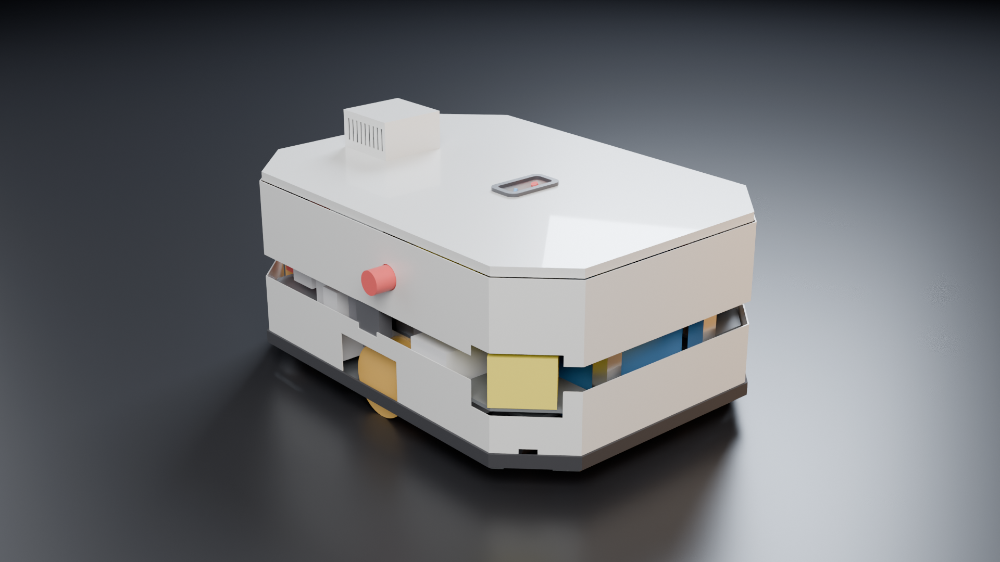

# Giorgio AMR: our own mobile base (design rev B4, 2026-10-05)

Giorgio's own mobile base. It is built from certified safety modules plus laser-cut, bent and bolted parts. It turns on the spot,
carries and powers the whole robot, and docks to charge by itself. **Rev B has no waist joint** (owner decision): the 15 mm top deck
is the superstructure flange, at the same height as before (z = 353 mm). Everything above it is unchanged: torso, arms, head, coffee
module and tray.

Status: **design, not built.** Rev B4 (`CAD_REV_B4.md`) implements the fixes of the certainty audit (`CERTAINTY.md`). The CAD has
170 parts, 0 interferences and 0 keep-out violations (24 keep-outs × all parts, 3,608 pairs); castor travel 0 overlaps; the
superstructure fits. Calculations: 53 PASS / 7 WARN / 1 FAIL (the FAIL is "OpenArm holding a cup by friction", so objects travel in the
tray). Electrical checks: 242 PASS / 0 FAIL, 11 OPEN (`electrical/CHECKS_AMR.md`).

**Certainty status (`CERTAINTY.md`, after rev B4) - not every value is documented yet:**
- BOM (82 counted rows): **49 DOCUMENTED, 32 PRICE-ONLY (quote needed), 1 GAP** (harness ampacity table: EN 60204-1 / DIN VDE 0298-4 to buy).
- CALC inputs (116): 51 documented by a manufacturer/standard document, 35 design values, 28 type tests, **2 GAP** (gripper length beyond
  the payload point; coffee machine power - machine not chosen).
- Netlist: **1 GAP**: the B48 prospective short-circuit current (not published) vs the 10 kA IEC breaking capacity of the Mersen HP10M
  branch fuses → 11 OPEN check rows, measured in TP-14.
- Evidence still to fetch by hand or buy: `DOWNLOAD_LIST.md` (Pilz B0 certificate, Discover UN 38.3 summary, two standards).



## Why our own base
No base on the market meets all three requirements:
- payload of at least 85 kg;
- automatic charging confirmed by the manufacturer;
- at least 370 W of power for the superstructure.

The closest, Slamtec Poseidon Standard, publishes neither a dock nor a price (`../docs/BASE_DECISION_2026-10-05.md`). Our own base
gives a documented, certified safety chain for CE, and puts power and docking under our control. At 10 units it also costs less than
a commercial base with the same content (`INDUSTRIALIZATION.md`).

## Architecture (rev B)
| Item | Choice |
|---|---|
| Kinematics | Differential drive: 2 rigid drive wheels at the centre (track 464 mm) + 4 sprung castors **Blickle L-ALST 80K** (D80, 200 kg) at (±275, ±180), each on a HIWIN MGN15 guide with 2 × Gutekunst D-313J-02 springs (28.3 N/mm, 76 N preload, −2.5/+17 mm travel) in the spine/battery gap (`CASTOR_SUSPENSION.md`). Rotates on the spot. |
| Body | 780 × 560 mm with 45° corners, ground clearance 32 mm (3.5 mm under the coaxial drive bodies). 15 mm deck = superstructure flange at z 353, with a 15 mm doubler under the column foot. |
| Drives | 2× ez-Wheel SWD 125 (4:1, brake; coaxial, 196 mm long, 7 kg each). Integrated STO SIL3/PL e; SBC, SLS, SDI SIL2/PL d; safe encoder. 24 V. Each drive runs in its own tunnel fed with room air from under the robot (SWD rated 0…+40 °C). |
| Battery | 2× Discover AES PRO DLP-GC2-48V in parallel: LFP 51.2 V, 3.07 kWh, IEC 62619 / UN 38.3 / CE. Each pack is under 2 kWh, so no EU battery passport is needed. Rev B2: each pack lies on its side with the top cover facing outward and 50 mm free in front of it (Discover manual 805-0027). Over-the-top straps hold it down, and it slides out at the front or rear. |
| Safety | 2× SICK nanoScan3 Pro I/O (PL d) on the front-right and rear-left castor-tower roofs; scan plane 184.5 mm (≤ 200 mm everywhere in the field incl. body pitch: per-band accel/decel limits, CALC §7b), continuous 40 mm slot all round. Safety controller: Pilz PNOZmulti 2 (B0 + 3 × EF 4DI4DOR + ES ETH, `electrical/ELECTRICAL.md`). 3 E-stops, key service disconnect, reset, enabling-pendant socket. |
| Power | B48 bus 40–58.4 V: 100 A NH00 fuse, SW80B contactor + precharge. Traction 24 V from 2× DDR-480C-24 in parallel with ORing and a 27 V clamp. S24 always on. All DDR/DRDN converters are mounted vertically with their Mean Well keep-outs; one DIN position table for CAD and electrical (`electrical/din_layout.md`). K0V 48 V cut-off = Carlo Gavazzi DUB01CD48500V. LYNK II gateway (120 × 135 × 44) on a bracket in the right bay. The Jetson is on the deck at the rear, under cover K06. |
| Dock | Roboteq RoboPad at the rear (z 120, off-centre at y −137, clear of the rear battery keep-out). The dock holds an NPB-750-48 charger (EMC Class B, DIP preset 56.8/53.6 V), a DC contactor, a Carlo Gavazzi DUB01CD48500V over-voltage relay (58.5 V) and a controller; the pads stay dead until the Hall sensor and the CAN handshake both confirm docking. AprilTag + reflector, Nav2 Docking Server. |
| Cooling | San Ace IP68 fans: 2 × 60 mm per side bay (intake above the wheel arch, exhaust on the rear cover), 2 × 40 mm for the centre bay, 1 × 60 mm per drive tunnel. Rated room ambient **0…+35 °C**. |

## Key numbers (`CALC.md`, rev B4)
- **Mass:** base 117.1 kg CAD (120.1 kg with harness; incl. 28 kg batteries). Robot 164.3 kg empty, 172.4 kg loaded.
- **Load split:** each drive wheel carries 40.6 % of the weight (flat, empty); castor rating 200 kg @ 4 km/h vs 121 kg (×3 obstacle factor).
- **Tipping:** worst lateral 4.65 m/s²; SS1 stop SF 3.13; cat-0 stop SF 1.32 (driving poses, WARN, type test TP-03a).
- **Speed:** top speed **1.1 m/s** (the castor rating speed, 4 km/h); safe bands **0.3 / 0.7 / 1.1 m/s** (SLS[1] / SLS[2] / SMS). Rotation on the spot up to 105°/s with the arms parked. Swept radius 440 mm.
- **Protective fields (incl. SICK's 150 mm ground-clearance supplement):** **401 / 613 / 943 mm** from the scanner and **357 / 407 / 457 mm** beside the robot at 0.3 / 0.7 / 1.1 m/s. Rotate-in-place circle R 912 mm. Arm-work field R 2472 mm, 50 mm resolution.
- **Accel / decel per band (scan plane ≤ 200 mm at the field edge):** 1.36/0.79, 1.15/0.69, 0.97/0.61 m/s².
- **Thresholds:** sharp ≤ 10 mm at any speed; 10–20 mm only bevelled ≤ 1:2 at ≤ 0.3 m/s.
- **Runtime:** OpenArm logistics 14.8 h, barista 6.6 h. With Kassow Edge arms (brochure power), 6.4 / 3.3 h.
- **Charging:** 20 → 90 % takes **4.93 h** with the NPB-750-48 (11.3 A); the NPB-1700-48 option 1.89 h.
- **Deck:** 25 MPa and 0.36 mm under 2 g + braking with the lower-bound strip and the doubler (limits 160 MPa, 0.55 mm). Tower roof at the 815 N bump-stop load: 52 MPa.
- **Thermal:** at 35 °C room the SWD tunnel air is 35.9 °C (logistics) / 37.9 °C (sustained 1.1 m/s on 6 %), side bays ≤ 39 °C.

## Operating rules that come from the design (go into the manual and the safety configuration)
1. Drive in reverse only at ≤ 0.3 m/s (SDI + SLS), which is used for docking. The cat-0 brake stop is grip-limited, with a safety factor of 1.32 against tipping in the driving poses, so use SS1 for every stop except power loss.
2. Never drive with the arms extended to the side or rear. Rotate on the spot only with the arms parked.
3. Objects travel in the tray or a form-fit cradle, not held by friction (CALC §8).
4. OpenArm variant: the arms move only while the protective field is clear. Hand-over happens through the tray.
5. Accel/decel limits per speed band (above) in the motion profile; scan plane checked with the test object at every field edge (184.5 ± 5 mm).
6. Floor: sharp thresholds ≤ 10 mm; 10–20 mm only bevelled ≤ 1:2 at ≤ 0.3 m/s. Castor preload 76 N per corner, set on a scale.
7. Room ambient 0…+35 °C; keep the floor under the robot free (the drive tunnels take their air there).

## Cost (`INDUSTRIALIZATION.md`, `bom_amr.csv`; mostly ESTIMATE)
| Variant | 1 unit | 10 units | 50 units |
|---|---|---|---|
| AMR alone incl. dock, materials + assembly | ≈ €26.1k | ≈ €21.9k | ≈ €19.2k |
| Giorgio R&D (OpenArm), materials + assembly | ≈ €38.6k | ≈ €33.2k | ≈ €29.5k |
| Giorgio with certified arms, materials + assembly | ≈ €92.0k | ≈ €82.5k | ≈ €75.1k |

The certified safety parts dominate the cost: 2 SICK nanoScan3 Pro I/O scanners (€2,394.95 each excl. VAT from a German distributor,
checked 2026-10-05) plus 2 system plugs NANSX-AAACZZZZ1 (€265.73 each), the Pilz PNOZmulti 2 station (B0 + 3 × EF 4DI4DOR + ES ETH,
€2,192.17 net + €115.23 terminals) and 2 safety wheel drives (€2.3k each). The castor parts (Blickle L-ALST 80K, HIWIN MGN15R/MGN15H)
have no published price: they are tagged QUOTE in `bom_amr.csv`. One-off CE and engineering costs (NRE) are on top: see `INDUSTRIALIZATION.md`.

## CE (`ce/`)
The route is **module A** (self-assessment, no notified body) under the Machinery Regulation (EU) 2023/1230, which applies from
20 Jan 2027. This holds as long as no machine-learning model performs a safety function.

Harmonised standards that apply:
- EN ISO 12100
- EN ISO 3691-4:2023 (base)
- EN ISO 10218-1/-2:2025 (arms)
- EN ISO 13849-1
- EN 60204-1
- EN ISO 13482 for the barista robot serving the public

Other legislation: RED (Wi-Fi) with EN 18031-1, EMC, and the Battery Regulation.

**Main blocker:** OpenArm has no brakes, which breaks MR Annex III 1.2.6(d). Fix it with brakes or spring balancing on J2/J4, or
switch to certified DC arms. The other gaps are listed in `ce/GAPS.md`.

## Folder map
| Path | What |
|---|---|
| `amr_params.py` | all dimensions, each tagged with its source |
| `amr_cad.py` | CadQuery model → `out/step`, `out/stl`, `out/dxf` (flat parts), `out/exploded`, `out/parts.json`; keep-outs → `out/keepout`, `out/keepouts.json`; checks → `out/interference.json` |
| `integrate.py` | checks the superstructure (`../cad/out/stl`) on the base → `out/integration.json` |
| `amr_calc.py` → `CALC.md` | mass, tipping, drives, energy, charging, safety fields, structure |
| `render_amr.py` → `renders/` | Blender renders: views, exploded, cables, dock, parts sheet |
| `electrical/` | netlist, single-line and safety diagrams, cable schedule, DIN layout, safety functions, checks |
| `ce/` | technical-file skeleton: risk assessment, essential requirements, test plan, DoC draft, manual outline, gaps |
| `INDUSTRIALIZATION.md`, `bom_amr.csv` | Italian suppliers, costs @1/@10/@50, timeline |
| `datasheet/` | product datasheet (HTML) |
| `CONTEXT.md` | shared assumptions for all work streams |
| `CERTAINTY.md` | certainty audit: every purchased row and calculation input with its official source and status (rev B4) |
| `DOWNLOAD_LIST.md` | the few documents that need a manual download or a purchase |
| `CAD_REV_B4.md` | rev B4: SWD at its documented size in drive tunnels, centre bay rearranged, deck doubler, real envelopes, checks |
| `CAD_REV_B3.md` | rev B3: castor suspension in the CAD, DIN layout = electrical, LYNK II real size, K0V/XD3 part numbers, checks |
| `CASTOR_SUSPENSION.md` | castor suspension design (sources, stack-ups, loads) |
| `CAD_REV_B2.md` | rev B2 CAD changes and keep-out checks (installation rules of the batteries and converters) |
| `archive/rev_A/` | rev A (with the waist joint), kept for reference |
| `archive/rev_B1/` | rev B1 `amr_cad.py` / `amr_params.py`, before the rev B2 installation-rule rework |
| `archive/rev_B2/` | rev B2 files (.py, .md, BOM, electrical/, ce/) before rev B3 |
| `archive/rev_B3/` | rev B3 files (.py, .md, BOM, electrical/, ce/, datasheet/, json results) before rev B4 |

Run everything:
```bash
# from the repository root; CAD env = cad/.env (cad/requirements.txt), BLENDER = Blender 4.5 binary
make amr-check                 # check_amr.py (PyYAML only) + amr_calc.py, seconds
make amr-cad                   # amr_cad.py + integrate.py + amr_calc.py in the CAD env (integrate needs cad/out: run make cad-validate once)
(cd amr/electrical && ../../cad/.env/bin/python make_diagrams.py)
make render-amr                # = $BLENDER -b -P amr/render_amr.py -- --view hero --out amr/renders/amr_hero.png
```

## Before pre-production (rev B4)
1. **Close the last GAPs** (`CERTAINTY.md` §3, `DOWNLOAD_LIST.md`): measure the B48 short-circuit current (TP-14, ≤ 10 kA for the HP10M
   fuses), buy EN 60204-1 / DIN VDE 0298-4 for the cable table, measure the gripper length, choose the coffee machine; file the Pilz B0
   certificate and the Discover UN 38.3 summary.
2. **Price quotes:** the 32 PRICE-ONLY rows (Discover packs, LYNK II, RoboPad, Albright, Blickle, HIWIN, Euchner pendant, San Ace fans, …).
3. **Vendor CAD:** SWD 125 STEP (cross-section, fixing points, connectors), DIN modules, castor; re-run the checks.
4. **Drawings:** 2D drawings with tolerances for every bolted joint.
5. **Prototype type tests:** TP-01…TP-23 (`ce/TEST_PLAN.md`), incl. TP-05/05b (fields with Z_F, scan plane), TP-11 (heat-run: SWD air ≤ 40 °C at 35 °C room) and TP-14 (Isc, regen with one DSR off).
6. **Arms decision:** brakes on OpenArm, or certified DC arms.
