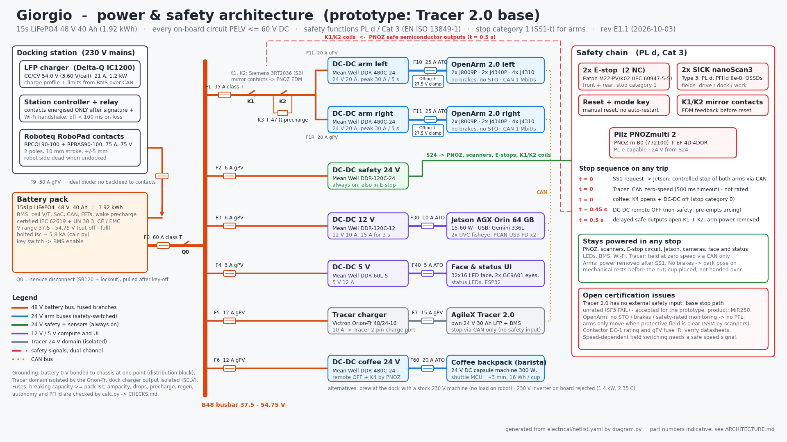

# Giorgio: electrical architecture (power, safety, charging)

Revision E1.1, 2026-10-03. Updated after the base decision in `cad/BASE_DECISION.md`: the **prototype/demo** stays on the AgileX Tracer 2.0, and the **sellable product** moves to the MiR250. The default configuration is now **barista**, with the coffee module on board.

Companion files:
- `netlist.yaml` is the single source of truth for the Tracer prototype: parts, ratings, branches, profiles.
- `variants.py` derives `netlist_mir250.yaml` (the MiR250 product) from it.
- `calc.py` checks both:

| Build | Checks file | Result | FAIL |
|---|---|---|---|
| Tracer prototype | `CHECKS.md` | 173 PASS, 1 FAIL | SF3, the Tracer base stop, section 8.6 |
| MiR250 product | `CHECKS_MIR250.md` | 157 PASS, 2 FAIL | SF2, a MiR safe output not documented; P2 autonomy 5.9 h vs 6 h. See section 8.7. |

- `diagram.py` draws `power_safety_architecture.svg/.png` (Tracer); `diagram.py --mir250` draws `power_safety_architecture_mir250.svg/.png`.
- `make_bom.py` writes the consolidated `../docs/BOM.md` and `../docs/bom.csv`.

This is an engineering design proposal. It is not a signed-off design. Every value is labelled either **[S]** (sourced: the URL is in `netlist.yaml > sources` and in section 13) or **[A]** (assumed: an estimate or a value recalled but not verified against a primary source). Before ordering parts or going to a notified body or test lab, a qualified electrical engineer must review it and must verify every [A] value.



---

## 0. What changed versus `docs/alimentazione_e_certificazione.md`, and why

| # | Earlier assumption | Finding | Consequence |
|---|---|---|---|
| 1 | "48 V 40 Ah = 1.92 kWh" | This holds only for a **15s** LFP pack (48.0 V nominal). A 16s pack is 51.2 V × 40 Ah = 2.05 kWh, which is above the 2 kWh line in EU 2023/1542, and it reaches 58.4 V at full charge. | **15s1p 40 Ah** chosen: 37.5–54.75 V, 1.92 kWh. The sim uses `--bat_wh 2400`; correct it to 1920 (README). |
| 2 | Arms could share the 48 V bus | DM-J4310 and DM-J4340P (24 V versions) have a recommended OVP of **32 V**. Only the J8009P accepts 24–48 V, and its absolute maximum is 52 V, which is still below the 54.75 V of a full pack [S dm_j4310, dm_j4340p, dm_j8009p_manual]. | Each arm gets a **regulated 24 V** bus from its own DC-DC. |
| 3 | "DC-DC 48→24 V" with no part number | The Mean Well DDR **D** suffix means 110 V input; it does not even start on 48 V. The 48 V parts are the **C** variants (33.6–67.2 V) [S mw_ddr480]. | DDR-480C-24 / DDR-120C-24 / DDR-120C-12 and DDR-60L-5 (L = 18–75 V). |
| 4 | Peak per arm about 720 W "from a 24 V 15 A supply" | OpenArm specifies 24 V 15 A per arm and, for heavy payloads, two supplies per arm (J1–J2 and J3–J8) [S openarm_v1_psu, openarm_v1_wiring]. The DDR-480C-24 gives 20 A continuous and **30 A for 5 s** [S]. | One DDR-480C-24 per arm covers 360 W continuous and 720 W peak (calc: 15.0 A ≤ 16 A at 80 % derating; 30.0 A ≤ 30 A). |
| 5 | A 230 V inverter of about 1.2 kVA | The Essenza Mini draws 1200–1310 W. A Phoenix 48/1200 delivers only 1000 W. A 48/2000 is needed: 1600 W at 25 °C, 1450 W at 40 °C, and it weighs **13 kg** [S]. | Coffee option A rejected; see section 11. |
| 6 | The PNOZ "stops the base" | The Tracer 2.0 manual documents **no external E-stop or safety input**. It has its own E-stop buttons that cut power, and CAN with a 500 ms command timeout [S tracer_manual]. | The base stop path is **not rated** (SF3 FAIL). This is the main certification blocker; see section 8.6. |
| 7 | OpenArm "safe stop" | The Damiao drives have **no STO and no brake option** (none in the dmBots repositories). Enactic itself warns: "if power is lost due to an emergency stop, the load being held will fall rapidly" [S openarm_safety]. | SS1-t (stop category 1), a park pose on mechanical rests, and no hand-to-hand handover; see section 12. |
| 8 | Safety contactors of unspecified type | Hermetic EV contactors (TE LEV100, Gigavac GX) have only plain auxiliary contacts. The PNOZ feedback loop (EDM) needs **mirror contacts** (IEC 60947-4-1 Annex F). | Siemens 3RT2 contactors with an integrated mirror NC contact [A: DC-1 rating to be verified]. |
| 9 | Coffee "decision 2" | The CAD (`cad/README.md`) carries the machine on the robot's back and assumes the 24 V DC option. The owner's default configuration is barista. | **On-board 24 V DC module is now the default** (option B: DDR-480C-24, K4, PNOZ cut). Brewing at the dock (C) stays as the fastest-to-certify alternative (section 11). |
| 10 | Generic spring dock contacts with a pilot pole | The CAD uses a Roboteq RoboPad collector: 2 poles, 75 A continuous, 75 V, ±5 mm lateral tolerance. | The handshake runs on the power poles (resistor signature + Wi-Fi); section 9. |
| 11 | One base for prototype and product | Tracer 2.0: no external safety input, internal modification forbidden (manual V1.0.0 p.3/p.11). MiR250: 1 auxiliary E-stop input, internal 2× nanoScan3, ISO 3691-4 design. | Tracer kept for the prototype with a documented gap (SF3). MiR250 variant for the product (section 8.7). |

---

## 1. Single-line diagram

```
 DOCK (230 V)                                   ROBOT (all PELV, <= 54.75 V DC)
 IC1200 charger 54.0 V / 21 A ─ relay ─(RoboPad + -)═╗
                                                    ║ W13 10 mm2
                                       ideal diode ─╨─ F9 30 A gPV ─┐ (charge input, BMS)
                                                                     │
 15s1p LFP 48 V 40 Ah + BMS ── F0 60 A class T ── Q0 (MSD, SB120) ───┴── B48 BUSBAR (37.5-54.75 V)
                                                                          │
   ├─ F1 35 A T ─ K1 ─ K2(‖K3+47 Ω) ─┬─ F1L 20 A ─ DDR-480C-24 ─ ORing ─ F10 25 A ─ ARM L (8 Damiao) + 27.5 V clamp
   │   (safety contactors, PNOZ)     └─ F1R 20 A ─ DDR-480C-24 ─ ORing ─ F11 25 A ─ ARM R (8 Damiao) + 27.5 V clamp
   ├─ F2 6 A gPV ─ DDR-120C-24 ─ S24 (always on): PNOZ, 2x nanoScan3, E-stops, K1/K2/K3 coils, beacon
   ├─ F3 6 A gPV ─ DDR-120C-12 ─ F30 10 A ─ Jetson AGX Orin (USB: Gemini 336L, 2 UVC fisheyes, 2 PCAN-USB FD)
   ├─ F4 3 A gPV ─ DDR-60L-5 ── F40 5 A ── LED face, GC9A01 eyes, LED strips, ESP32
   ├─ F5 12 A gPV ─ Orion-Tr Smart 48/24-16 (isolated, 28.4 V / 10 A) ─ F7 15 A ─ Tracer 24 V 30 Ah battery ─ Tracer drive
   └─ F6 12 A gPV ─ DDR-480C-24 ─ K4 ─ F60 20 A ─ 24 V capsule machine 300 W + shuttle MCU (barista default; cut by PNOZ)
 0 V: single bond to chassis at the distribution block. The Tracer domain is galvanically separate (via the Orion-Tr).
```

## 2. Voltage domains

| Bus | Voltage | Source | Switched by safety? | Loads |
|---|---|---|---|---|
| B48 | 37.5–54.75 V (15 × 2.5–3.65 V) | pack via F0, Q0 | no (BMS FETs, key switch) | all DC-DCs, Tracer charger |
| A24L, A24R | 24.0 V regulated, clamp at 27.5 V | DDR-480C-24 (one per arm) | **yes: K1+K2 on the 48 V feed** | OpenArm left and right, 8 Damiao each |
| S24 | 24 V | DDR-120C-24 | no (stays on in E-stop) | PNOZ, scanners, E-stops, contactor coils, beacon |
| C12 | 12 V (Jetson module 7–20 V) | DDR-120C-12 | no | Jetson AGX Orin, USB cameras |
| L5 | 5.1 V | DDR-60L-5 | no | LED face, eyes, strips, ESP32 |
| T24 | 22–29.2 V (Tracer LFP) | Tracer battery; charged by the Orion-Tr | Tracer's own E-stop | Tracer drive and controller |
| COF24 | 24 V (barista default) | DDR-480C-24 | yes (PNOZ: remote OFF + K4, cat 0) | 24 V capsule machine, shuttle MCU, Actuonix |

The whole robot stays below 60 V ripple-free DC. That is the IEC 60204-1 §6.4 PELV limit for dry locations where large-area body contact is not expected [A: clause recalled]. Live parts are still covered to IP2X / IPXXB, because the dock contacts are exposed (section 9).

## 3. Loads (per bus)

"cont" = maximum sustained draw (used for sizing). "peak" = up to the stated time (used for DC-DC and fuse checks). "typ" = active average (used for autonomy).

| Load | Bus | typ W | cont W | peak W | Basis |
|---|---|---|---|---|---|
| OpenArm 2.0 left (2× DM-J8009P J1–J2, 2× DM-J4340P J3–J4, 4× DM-J4310 J5–J7 + gripper) | A24L | 70 | 360 | 720 / 5 s | cont: OpenArm reference PSU 24 V 15 A per arm [S openarm_v1_psu]. Peak: two-PSU advice [S openarm_v1_wiring]. typ: copper-loss model [A]. |
| OpenArm 2.0 right | A24R | 70 | 360 | 720 / 5 s | same |
| Damiao datasheet values for reference | | | | | J8009P 24 V, 20 A rated / 50 A peak phase current, OVP ≤ 52 V. J4340P 24 V, 2.5 / 8 A, OVP 32 V. J4310 24 V, 2.5 / 7.5 A, OVP 32 V [S]. Phase currents are not bus currents: the bus current is P/V_bus. |
| SICK nanoScan3 × 2 | S24 | 3.9 each | 6 | 8 | 3.9 W typical without output load [S sick_nanoscan3]. |
| Pilz PNOZ m B0 + EF 4DI4DOR | S24 | 5 | 7 | 9 | [A] |
| K1, K2 (3RT2036 DC coil) + K3 | S24 | 27 | 27 | 30 | 13 W per S2 DC coil [A]. An electronic-coil variant would save about 20 W. |
| Beacon, dock handshake MCU | S24 | 2 | 4 | 5 | [A] |
| Jetson AGX Orin 64 GB + carrier | C12 | 35 | 75 | 100 | Module 15–60 W, input 7–20 V [S jetson_agx_orin_ds]. Carrier peak [A]. |
| Orbbec Gemini 336L (USB) | C12 | 3 | 3 | 6 | < 3 W average, < 6 W peak [S orbbec_336l] |
| 2 × USB UVC fisheye + powered USB hub (replace the Insta360 X4, FEASIBILITY.md §5) | C12 | 5 | 8 | 12 | [A] |
| 24 V DC capsule machine (truck type) | COF24 | per profile (8 cups/h ≈ 120 W) | 300 | 330 | 300 W / 12.5 A [S truck_24v_capsule] |
| Coffee shuttle MCU + Actuonix P16 | COF24 | 1 | 6 | 12 | [A] |
| 32×16 P4 LED face | L5 | 3 | 10 | 10 | Scaled from a 64×32 P4 panel (5 V 4 A) [S waveshare_p4, A] |
| GC9A01 eyes + ESP32, LED strips | L5 | 3.5 | 8 | 9 | [A] |
| Tracer charger (Orion-Tr input) | B48 | balancing | 330 | 330 | 28.4 V × 10 A / 0.87 [A] |
| Tracer traction (2 × 400 W BLDC) | T24 | 60 driving | 400 | 800 | 40–80 W on flat floor; 2 × 400 W motors [S tracer_manual] |
| Tracer controller and lights | T24 | 15 | 15 | 20 | [A] |

Optional hands, not in the default build:
- **AmazingHand**: 8 × Feetech SCS0009 at 4.8–7.4 V, stall 1 A at 6 V. Pollen recommends 5 V 2 A per hand. It fits on L5 (DDR-60L-5 has about 8 A spare) or on a dedicated DDR-60L-5.
- **ORCA Hand**: 17 × Feetech STS3215 at 12 V, stall 2.7 A. Typical 12 V 5–10 A per hand. It needs **its own DDR-120C-12 per hand**, because C12 has no margin left (7.2 A of 8 A derated).

Both are listed in the sources of the research notes. With either hand, the OpenArm J8 gripper motor is removed.

## 4. Power budget, autonomy, charge time (from `CHECKS.md`)

**DC-DC sizing**
- Arm DC-DCs: 15.0 A continuous ≤ 16 A (80 % of 20 A); 30.0 A peak ≤ 30 A for 5 s. Beyond 5 s the DDR drops to a 105–135 % constant-current limit with auto-recovery and does not shut down [S].
- Peak power per arm must be capped in firmware at 720 W, which is 30 A at 24 V, by setting the Damiao current limits [A: OpenArm default limits not checked].
- S24: 2.1 A of 4 A. C12: 7.2 A of 8 A. L5: 3.5 A of 9.6 A.

**Pack current**

| Case | Power | Current at 37.5 V | C-rate | Limit |
|---|---|---|---|---|
| All peaks at once: both arms at 720 W, plus compute, UI, and coffee or Tracer charger | 2156 W | 57.5 A | 1.44 C | cell 2 C pulse (80 A) [A], BMS 200 A / 10 s [A] |
| All loads at maximum sustained | 1287 W | 34.3 A | 0.86 C | 1 C continuous [A] |

- Under the all-peak load, the pack sags to 43.8 V at 10 % SoC, well above the DC-DC turn-off of 33 V.
- At cut-off (2.5 V/cell) the pack sits at 36.3 V. So the BMS and Jetson start a controlled shutdown at 10 % SoC.

**Autonomy**
- Usable energy: pack 1728 Wh (90 % DoD), Tracer 653 Wh (85 %).
- "Combined" means the onboard isolated charger tops up the Tracer battery from the pack (energy balancing, efficiency 0.87).

| Profile | Pack draw | Tracer draw | Pack alone | Combined |
|---|---|---|---|---|
| P1: logistics kitting, arms active 100 %, driving 30 % | 266 W | 33 W | 6.5 h | **7.6 h** |
| P2: barista, 8 cups/h brewed on board (≈ 120 W), arms 25 %, driving 20 % | 299 W | 27 W | 5.8 h | **7.0 h** |
| P3: reception or standby, arms parked and powered | 113 W | 15 W | 15.3 h | **17.6 h** |

**Energy-management interlock (non-safety, Jetson).** The Orion-Tr is switched off while the coffee heater runs. Otherwise the sustained case would reach 43 A (1.08 C).

Arm averages are an estimate: 70 / 30 / 10 W per arm [A], from the copper-loss model of section 3. The doc's earlier "~250 W, 6–7 h" estimate is consistent with P1.

**Charging**
- The dock delivers 21 A × 54 V = 1134 W, which is 0.53 C.
- With the robot's 120 W hotel load, 1014 W net goes into the pack.
- The Tracer is charged only once the pack is above 80 % (or the Tracer is below 30 %).

| Charge | Time |
|---|---|
| 20 → 80 % | **75 min** |
| 0 → 100 % (including Tracer share and CV tail) | **2.4 h** |
| Tracer 10 → 90 % at 10 A | 2.2 h (AgileX's own charger: 3 h) |

## 5. Battery and battery protection

**Pack.** 15s1p LiFePO4, 40 Ah, 1.92 kWh, IP54 case, CAN BMS.
- Bought **as a complete pack** from an integrator who supplies **IEC 62619** and **UN 38.3** test reports plus a CE/EMC declaration. Reference cell: CALB CA40 class [A]. Estimated mass about 19 kg [A].
- At ≤ 2 kWh, the pack stays out of the battery-passport (Art. 77, from 18 Feb 2027) and carbon-footprint duties that EU 2023/1542 sets for industrial batteries **> 2 kWh** [S eu_battery_reg via thebatterypass.eu].
- Extended producer responsibility (registration, take-back) and labelling apply at any size.
- If an off-the-shelf 2.4 kWh module is bought instead (e.g. a 15s 50 Ah rack module), those duties fall on its manufacturer. Most such modules are certified for stationary ESS, not mobile use; check vibration and shock coverage.

**Mass and size versus the CAD.**
- The CAD now budgets the pack at **13 kg**, in a flat 270 × 400 × 85 mm envelope (`cad/VALIDATION.md` mass budget). For 1.92 kWh that is about **148 Wh/kg at pack level**, at the top of what LFP packs reach (cells about 160–180 Wh/kg). Treat it as **optimistic until a supplier quotes it**.
- `cad/out/bom_parts.csv` still calls it "16S". The electrical design requires **15s**.
- **Fallback if 13 kg cannot be met** (calc run on a copy of the netlist): **15s 30 Ah** (1.44 kWh, about 11–13 kg).
  - It needs cells rated **≥ 1.2 C continuous / 2 C pulse**: sustained 1.14 C, all-peak 1.92 C.
  - P2 barista autonomy drops to 5.6 h; P1 6.1 h and P3 14.2 h still pass.
- **15s 20 Ah is not acceptable**: 2.9 C peaks, 1.05 C dock charge, 4.3 h barista.

**BMS requirements** (pack supplier, [A]):
- Cell voltage and temperature monitoring.
- Discharge 100 A continuous / 200 A for 10 s; charge 40 A.
- MOSFET disconnect with a **precharge on wake** for the whole B48 capacitance.
- CAN 2.0B to the Jetson and to the dock charger: limits, SoC, faults, charge enable.
- Key/enable input.
- Short-circuit trip in < 500 µs. This is a second protection layer and is not credited in fuse selection.

**Prospective short circuit.** R_min = 15 × 0.5 mΩ (lowest plausible AC-IR) + 1.5 mΩ interconnects + 0.5 mΩ BMS path = 9.5 mΩ, so **Isc ≈ 5.8 kA** bolted at 54.75 V [A: cell IR]. This is why:
- **F0, the main fuse**, is a Littelfuse **JLLN060 class T** (160 V DC, **20 kA DC** interrupting rating for 35–1200 A, UL 248-15) [S lf_jlln], in an LFT60 holder, within 150 mm of the pack terminal.
- **Branch fuses on B48** are **10×38 gPV fuses** (Littelfuse SPF, 1000 V DC, 20 kA [A: rating recalled; the Littelfuse site blocks fetching]) or class T where the branch is ≥ 35 A.
- **Automotive 58 V fuses are not used on B48.** ATO/MINI/MAXI 58 V are rated only 1 kA at 58 V [S lf_tac58], and MIDI/MEGA 58 V about 2 kA [A]. Both are below 5.8 kA.
- On the 24/12/5 V outputs the DC-DCs limit fault current to ≤ 1.35 × rating, so ATO 32 V fuses are fine there.

**Service disconnect (Q0).** An Anderson SB120 between pack and distribution, with a lockout cover.
- It is **not a load-break device**. Procedure: key-off (the BMS opens its FETs and the DC-DCs fall to zero), then pull Q0, then lock out.
- A pyro fuse or pyro disconnect is not justified at 48 V / 2 kWh. The class T fuse plus the BMS FETs give two independent interruption means.
- If a load-break switch is preferred, use a lockable DC switch-disconnector rated ≥ 80 V DC / 100 A [A: part not selected; Blue Sea 9003e is 48 V max, so it is too low].

## 6. Arm power path, precharge, regen

**Topology.** B48 → F1 (35 A class T) → **K1 → K2** (Siemens 3RT2036-1BB40, 3 poles in series, with a mirror NC in the PNOZ feedback loop) → F1L/F1R (20 A gPV) → DDR-480C-24 (one per arm) → Mean Well DRDN40-24 ORing module → F10/F11 (25 A ATO) → 6 mm² cable up the column → OpenArm hub. Each arm has its own 27.5 V shunt clamp.

The contactors switch the **48 V feed**, so a single pair removes energy from both arms and from both converters.
- Worst-case break current: 41.7 A (both converters at 150 % at 37.5 V, with SS1 failed). The assumed DC-1 rating is 50 A at 60 V with 3 poles in series [A: verify in the Siemens 3RT2 DC switching table].
- In normal operation the break current is below 3 A. SS1 has already stopped the arms, and the PNOZ releases the DC-DC remote-ON pins 50 ms before K1/K2 open.
- If the Siemens rating does not verify, use a **Schaltbau C195** (rail/forklift DC contactor, 320 A, positive-opening S870 auxiliary switch [S schaltbau_c195]; still confirm mirror-contact status).

**Precharge** (sequence run by the PNOZ and the Jetson after a reset):
1. EDM check: K1 and K2 mirror contacts are closed, i.e. the contactors are open.
2. K1 closes. K3 + 47 Ω (Arcol HS50) bypasses K2. Both DC-DCs are held **OFF** on their remote pin, which is mandatory: the DDR turns on at 33.6 V and would load the RC so precharge never finishes.
3. After 0.5 s the capacitance is above 95 % (τ = 47 Ω × 3000 µF = 141 ms, so 3τ = 0.42 s). K2 closes and K3 opens.
4. The DC-DCs are enabled. Their 500 ms soft start then charges the 24 V side.

Resistor duty:
- Energy per precharge ½CV² = 4.5 J; initial 1.16 A / 64 W; the residual step at K2 is 2.7 V.
- Input capacitance is **[A]** (2 × 470 µF internal, assumed, plus 2 × 1000 µF bulk). Measure it at bring-up.

**Regen / back-EMF.**
- **Clamp needed.** The DDR-480C cannot sink current. Its OVP (28.8–35 V) **shuts the output down**, latching until power is cycled [S]. The 24 V Damiao drives flag OVP at 32 V [S]. The bus capacitance alone absorbs only about 0.23 J between 24 and 27.5 V, against about 50 J for a hard stop of one arm with payload [A].
- **Fix:**
  - an **ORing ideal-diode module per arm**, so regen never reaches the converter output;
  - plus a **shunt regulator per arm**: comparator + MOSFET + Arcol HS100 1.8 Ω on the base plate, on at 27.5 V and off at 27.0 V. It absorbs 420 W at threshold.
  - Off-the-shelf alternative: an AMC SRST-type shunt regulator [A].
- **The clamp window** sits between 25 V and 28.8 V, below both OVPs.
- **Bidirectional DC-DC** (e.g. a Vicor bus converter), which would return regen to the pack, is not worth it: about 100 J per stop is negligible energy.

## 7. Wiring, fuses (summary of `CHECKS.md`)

| Branch | Current cont / peak | Cable | Iz (derated) | Fuse | Drop |
|---|---|---|---|---|---|
| W01 pack → busbar | 34.2 / 56.5 A | 16 mm² | 60 A | F0 JLLN 60 A T | 0.14 % |
| W02 arm feed (K1/K2) | 20.9 / 41.7 A | 10 mm² | 40 A | F1 JLLN 35 A T | 0.11 % |
| W03L/R DC-DC inputs | 10.4 / 20.9 A | 6 mm² | 23.3 A | 20 A gPV | 0.06 % |
| W04L/R 24 V up the column, 1.8 m | 15 / 30 A | 6 mm² | 32 A | 25 A ATO | 0.77 % |
| W05/W06/W07 aux DC-DC feeds | ≤ 3.6 A | 1.5 mm² | 8 A | 6 / 6 / 3 A gPV | < 0.1 % |
| W08 Tracer charger feed | 8.8 A | 4 mm² | 14.8 A | 12 A gPV | 0.12 % |
| W09 Orion → Tracer battery | 10 A | 2.5 mm² | 16.7 A | 15 A gPV at the Tracer battery | 0.52 % |
| W11 12 V Jetson | 7.2 / 10.1 A | 2.5 mm² | 12 A | 10 A ATO | 0.59 % |
| W12 5 V to the head, 1.4 m | 3.5 A | 1.5 mm² | 10.8 A | 5 A ATO | 2.66 % (< 5 %) |
| W13 dock charge path | 21 A | 10 mm² | 40 A | F9 30 A gPV (at the pack) | 0.16 % |

**Ampacity basis.** IEC 60204-1 Table 6 style base values: PVC 70 °C, method B1 (in duct), 40 °C reference. Corrections applied: ambient 45–50 °C inside the base, grouping 0.65–0.8 [A: table values recalled; verify against the standard]. Short peaks up to 1.5 × Iz for ≤ 10 s are accepted.

**Cable type.** Class 5 flexible tinned copper. In the base, prefer 90–105 °C insulation (H07Z-K, or silicone for the column flex).

**Connectors.**
- XT60 at the column base for each arm.
- Anderson Powerpole PP45 for the 24/12 V branches.
- SB120 at the pack.

## 8. Safety architecture

### 8.1 Safety functions and required PL (EN ISO 13849-1)

| ID | Function | Initiation → reaction | PLr / Cat | Result (calc) |
|---|---|---|---|---|
| SF1 | Emergency stop | 2 × E-stop (2 NC) → PNOZ → SS1-t (t = 0.5 s) → K1 + K2 open; base: CAN zero-speed only (no hardwired input on the Tracer) | d / 3 | arm part PFHd ≈ 2.0e-7 PASS [A] |
| SF2 | Protective stop on person detection | nanoScan3 OSSD (front, rear) → PNOZ → same as SF1 | d / 3 | ≈ 1.8e-7 PASS (scanner 8.0e-8 [S]) |
| SF3 | Base stop | scanner / E-stop → PNOZ → Jetson → CAN zero-speed (0x111) / 500 ms command timeout | d / 3 | **FAIL: no rated stop path into the Tracer** |
| SF4 | Mode-dependent fields (drive / dock / work) | PNOZ selects the nanoScan3 field set | d | needs a safe speed signal (8.5) |
| SF5 | Manual reset, no automatic restart | reset button + EDM | — | ISO 13849-1 §5.2.2 |

**Why PL d.** Risk graph:
- **S2:** possible irreversible injury. Arm strike or pinch with 4 kg payload, hot liquid, a 130 kg robot collision.
- **F2:** frequent exposure, since this is a public/service environment.
- **P1:** avoidance possible. This is justified only with arm Cartesian speed ≤ 250 mm/s near people, base ≤ 0.3 m/s inside the warning field, and visible/audible warning.

That gives **PLr d**. It is also the default of ISO 10218-1 (PL d, Cat 3) and the requirement of ISO 3691-4 for personnel detection and speed control [A: clauses recalled]. If the risk assessment ends at P2, PLr becomes **e**: the PNOZ can do it, the nanoScan3 (PL d) cannot.

**PFHd basis.** Only the nanoScan3 value is sourced. The E-stop, PNOZ and contactor figures are placeholders (1e-7, 3e-9, 1e-7). Compute them in SISTEMA with the Pilz/Siemens/Eaton libraries (B10D: contactor about 1.3 M at nominal load, E-stop about 100 k; nop from the duty profile).

### 8.2 Stop categories (IEC 60204-1 §9.2.2)

- **Arms: category 1 (SS1-t) for both E-stop and protective stop.**
  - Category 0 would drop the arms: no brakes, backdrivable QDD, carrying hot cups.
  - SS1-t sequence:
    - t = 0: the PNOZ signals the Jetson (non-safety). The Jetson commands a controlled deceleration and a hold in place over CAN, then moves to the park pose if time allows.
    - t = 0.45 s: the DC-DC remote pins go OFF.
    - t = 0.5 s: delayed safe semiconductor outputs open K1 and K2.
  - Timing is enforced by the PNOZ (safety-rated). The deceleration itself is not, which is acceptable for SS1-t.
  - If the CAN path fails, Damiao drives exit Enable on CAN timeout, which removes torque [S dm_j8009p_manual]. Power removal at 0.5 s is guaranteed.
- **Base (Tracer 2.0): only a non-safety stop is possible.** At t = 0 the Jetson sends zero speed on CAN (500 kbit/s, frame 0x111). If the Jetson or the CAN link fails, the Tracer's 500 ms command timeout stops it [S tracer_manual]. The Tracer's own E-stop switch is on the vehicle and cannot be wired to the PNOZ without opening the vehicle, which the manual forbids. Braking distance per the datasheet: **0.9 m from 2 m/s, empty**; it is longer at 100 kg payload and must be measured. Worst-case field length (ISO 13855: S = K·T + C) must include the 500 ms timeout: at 1 m/s, 0.5 m of travel before braking even starts. In the sim, the current fields are 1.72 m protective and 2.82 m warning.
- **Coffee module (barista default):** category 0 (DC-DC remote OFF + K4: heater, pump and shuttle off).

### 8.3 What stays powered in a stop

Stays powered:
- PNOZ, scanners, E-stop circuit, contactor-coil supply (S24).
- Jetson, cameras, Wi-Fi, face/status LEDs (C12, L5).
- BMS. Tracer: stays fully powered, held at zero speed by CAN (no safe power removal is available, see 8.6).

Loses power:
- Arm buses.
- Coffee module (option B).

The robot stays able to explain itself: the face shows "stopped", the logs keep running.

### 8.4 Devices

- **E-stops.** Two Eaton M22-PV/K02 (2 NC, IEC 60947-5-5) with a yellow guard: one on the back of the head/column, one on the base rear. Wired dual-channel with PNOZ test pulses (cross-fault detection).
  - Optional handheld wireless E-stop rated PL d for the operator.
  - The Tracer's own E-stop switch stays as AgileX built it (vehicle-mounted, not wired to the PNOZ).
- **Reset.** Blue illuminated pushbutton, outside the hazard zone, with a view of the robot.
- **Scanners.** Two SICK nanoScan3, Pro I/O variant NANS3-CAAZ30AN1 with field-set switching [S]: Type 3, SIL 2, PL d, 70 ms response, 3.9 W typical.
- **Logic.** Pilz PNOZ m B0 (772100: 20 safe inputs, 4 safe semiconductor outputs) [S datasheet] plus PNOZ m EF 4DI4DOR [A: part number] for potential-free relay outputs (coffee module, beacon; a rated base-stop input if a future base offers one).

### 8.5 Field switching needs a safe speed

Speed-dependent protective fields (as in the sim) require that the active field set is selected from a **safety-rated speed** signal. The Tracer exposes only non-safe CAN odometry. Options:
- (a) Two independent incremental encoders on sprung measuring wheels, fed into a PNOZ m EF 2MM speed-monitoring module [A: module name], giving PL d speed monitoring.
- (b) Fixed worst-case fields per mode (drive / dock / work), selected by the PNOZ only from mode inputs. This means larger fields and more stops.

Both need validation.

### 8.6 Blocking issue: the Tracer 2.0 has no rated stop input

Verified in the Tracer 2.0 user manual V1.0.0 (2025.03):
- The rear 4-pin aviation connector carries only pin 1 VCC (23–29.2 V, max 5 A), pin 2 GND, pin 3 CAN_H, pin 4 CAN_L (p.11).
- The E-stop is a switch on the vehicle. No external E-stop or safety input is documented.
- The manual forbids modifying the internal structure.

So the only stop path is CAN (non-safety) plus the 500 ms command timeout. Wiring PNOZ contacts into the internal E-stop circuit is excluded: it would modify a bought-in machine against the manual and would rely on an unrated circuit.

Giorgio uses only the rear connector's CAN pins (through an isolated CAN adapter). The VCC pin is not used: the 5 A / 120 W accessory limit is irrelevant, because the superstructure runs from its own pack.

Actions:
1. Ask AgileX for an external E-stop/safety interface, its PL/category, braking behaviour and stopping distances, and a declaration of incorporation with ISO 3691-4 information.
2. If they cannot provide it, plan a base with documented safety I/O for the certifiable product.

`calc.py` keeps SF3 as **FAIL** until a rated element exists.

**Decision (cad/BASE_DECISION.md):** the gap is **accepted for the R&D prototype and demos only**, recorded in the risk assessment. The base is stopped by CAN plus the 500 ms timeout; the PNOZ safely removes arm power. Operating limits:
- 2 × 3 kg objects per arm, software-enforced;
- reduced speed near people;
- the AgileX payload confirmation in writing.

### 8.7 Product variant on the MiR250 (`netlist_mir250.yaml`, `CHECKS_MIR250.md`, `power_safety_architecture_mir250.png`)

**What changes electrically**
- **Removed:** the Tracer battery island (Orion-Tr, F5/F7, W08/W09), our 2 nanoScan3 and their pods (the MiR has 2 integrated), and the isolated CAN adapter. The MiR is driven over Ethernet/REST.
- **Base stop (SF3 → PASS [A]).** PNOZ m EF 4DI4DOR relay contacts open the **MiR250 auxiliary emergency-stop input** [S mir250]. The MiR safety system (12 safety functions to ISO 13849-1, ISO 3691-4 design with listed exceptions) stops the base. The PFHd of the MiR chain is a placeholder (2e-7) until MiR provides its value.
- **Arm stop on person detection (SF2 → FAIL, pending).** The MiR's own scanners must trigger SS1 of the arms. That needs a **dual-channel safe output** from the MiR safety system ("protective stop active"). The spec page lists only 4 DI / 4 DO (not stated as safety-rated) plus the auxiliary E-stop **input**. Ask MiR for the user guide (top-module safety I/O).
  - If no safe output exists, keep **one or two of our own nanoScan3** for the arm zone: +€2.3–4.6k. With the arm-zone scanners back, SF2 is the same as on the Tracer and passes.
- **Charging.** A combined station: the MiR charging station charges the MiR battery, and our IC1200 on the RoboPad charges our pack. MiR VL-marker docking (±3 mm [S]) is inside the RoboPad tolerance (±5 mm).
- **Autonomy.** The MiR battery no longer subsidises our pack. P2 barista is **5.9 h, just under the 6 h target** (FAIL, deliberately not hidden). Ways to close it:
  - one 15-min top-up per shift (+0.85 h);
  - superstructure power from the MiR top-module supply, if MiR offers one with ≥ 300 W (UNVERIFIED);
  - fewer cups per hour.
- **Deck height.** The deck is 131 mm higher: re-check the 24 V arm cable length (W04 at 1.8 m has margin: 0.77 % drop).

## 9. Charging and docking

**Station.**
- A CE-marked LFP charger: Delta-Q IC1200 class, 1.2 kW, CAN [A: model data not verified], on a custom 15s profile.
  - CC 21 A, then CV **54.0 V (3.60 V/cell)**, terminating at C/20 or on a BMS request.
  - Charging blocked below 0 °C (BMS cell temperature).
- A station controller and output relay keep the contacts **de-energised by default**.

**Contacts.** Roboteq **RoboPad**, the part chosen in the CAD: collector RPCOL90-100 on the robot nose plus base RPBAS90-100 on the station [S robopad].
- 2 poles, 100 A max / 75 A continuous, 75 V, 10 mm sprung stroke, ±5 mm lateral tolerance. Calc: 21 A ≤ 75 A.
- The sim's docking test reached ≤ 2.0 mm lateral error. The sim's 20 mm acceptance window must be tightened to the RoboPad's ±5 mm.
- There is **no pilot pole**, so the handshake runs on the power poles.

**Handshake** (contact voltage only after it):
1. While idle, the station applies only a current-limited sense voltage to the poles: 12 V through 2.2 kΩ, ≤ 5 mA, not hazardous.
2. The robot presents a signature: a 10 kΩ resistor across its poles, upstream of the ideal diode. The station sees the expected divider voltage.
3. In parallel, the robot confirms over Wi-Fi/BLE: docked, filtered contact compression OK (the sim's 10-reading filter), BMS charge-enable, SoC.
4. Only then does the station close its output relay and enable the charger. The current ramps in about 1 s.

**Undock.** The robot first asks the station to stop over Wi-Fi. It moves only after the charger current reads zero (BMS CAN).
- If the robot is pushed away while charging, the station sees the current collapse and the voltage rise. It opens the relay in < 100 ms.
- The RoboPad is designed for this charge-contact duty at 75 V. A small arc at ≤ 21 A / 54 V is still possible in this fault case, so contact wear is to be inspected in maintenance.
- An optional third sprung pilot pin (first-break) can be added beside the RoboPad if the risk assessment asks for it.

**Robot side.**
- An **ideal-diode module** (Mean Well DRDN40-48 [A]) plus F9 sit between the contacts and the pack. The robot's exposed contacts are therefore **never back-fed** by the pack: they are dead when undocked.
- The BMS charge FET adds a second barrier.

**Tracer battery.**
- Charged by the onboard **Victron Orion-Tr Smart 48/24-16** (isolated, LiFePO4 profile, absorption 28.4 V) [A: Orion data not fetched].
- It connects **through the Tracer's external 2-pin aviation charging port**, using a mating plug on Giorgio's harness, exactly where AgileX's charger plugs in (manual p.11, p.15). The vehicle is not opened.
- Current set to 10 A, the rating of AgileX's own 10 A charger [S].
- Charging is inhibited below 0 °C ambient (manual: charge only above 0 °C); the BMS temperature or a base thermistor gates the Orion enable.
- Fuse F7 is at the Orion end of the harness. The Tracer battery's own BMS protects the vehicle side.
- Enabled when docked and the pack is above 80 %, or whenever the Tracer is below 30 % (energy balancing).
- **Open items:**
  - Confirm with AgileX that a third-party CC/CV source (28.4–29.2 V, 10 A) on the charging port is acceptable. The manual requires a "dedicated lithium battery charger" and gives no charge voltage [S].
  - Confirm whether the Tracer may drive while the charging plug is energised. If not, charge it only while docked.

**Alternative v2.** Remove the Tracer battery and feed the base from B48. That would modify the vehicle's internal structure, so it is excluded unless AgileX approves it.

## 10. Grounding, bonding, EMC

**Grounding and bonding.**
- B48 0 V (after the BMS shunt) is bonded to the chassis at **one point**: the distribution block, 6 mm² strap.
- Metal parts are bonded to that point: Tracer top frame, aluminium column, arm bases, enclosure plates.
- The Tracer domain is galvanically separate (Orion-Tr isolated). Bond its 0 V to the chassis at one point too, and use an isolated CAN adapter or a common reference for the Tracer CAN.
- The dock charger output is isolated (SELV), and the station PE is not connected to the robot.
- Result: a short from + to chassis is a bolted fault cleared by fuses, and there is no circulating current through CAN shields.

**EMC.** Target EN 61000-6-1 (immunity) and EN 61000-6-3 (emissions) for commercial environments. Industrial sites need 6-2/6-4.
- The DDR-480C has **conducted emissions class A** on its DC input; radiated is class B [S]. The DDR-60L is class A conducted [S].
  - Budget a DC input filter on the arm converters (e.g. a Schaffner FN2200-class filter [A]).
  - Measure robot-level conducted emissions on the dock-charging port.
  - The DDR-120C is class B [S].
- Twist the +/− pairs of all power runs. Keep the 24 V arm power and the CAN in separate cable channels in the column.
- CAN: shielded twisted pair, 120 Ω termination at both ends, shield clamped 360° at the base entry.
- Ferrites on the USB cables (UVC fisheyes, Gemini) and on the HUB75 ribbon.
- ESD (8 kV air): touchable metal bonded to the chassis; the dock contacts are recessed.
- Radio: Jetson Wi-Fi/BLE and any LTE router need **RED** conformity of the modules plus EN 18031 (cybersecurity), already listed in the earlier doc.

## 11. Coffee machine power decision

| | A: 230 V machine on board + inverter | **B: 24 V DC capsule machine on board (DEFAULT, barista)** | C: stock 230 V machine at the dock |
|---|---|---|---|
| Hardware | Essenza-class 1200–1310 W [S] + Victron Phoenix Smart 48/2000 (13 kg, EN 60335-1, ECE R10) [S] | Truck-type 24 V 300 W (12.5 A) or Handpresso Auto 120 W [S, CE/EN 60335-2-15 not stated], fed by DDR-480C-24 | Essenza-class machine in the station, on the station mains |
| DC draw | 1409 W (37.6 A at 37.5 V) | 326 W (8.7 A) | 0 |
| All-peak pack current | 94 A = 2.35 C → **exceeds** the 2 C cell pulse [A]. Needs a brew/arm interlock **and** F0 ≥ 90 A plus a larger cable. | 65 A = 1.63 C, OK. F0 60 A still OK (needs ≥ 54 A). | 56 A = 1.41 C |
| Brew time | about 25 s heat-up + 30 s | about 2–4 min | about 1 min |
| Pack energy per cup | about 16 Wh [A] | about 16 Wh [A] | 0 |
| Autonomy P2 + 8 cups/h | 7.5 h | 7.4 h | **11.6 h** |
| Certification impact | 230 V AC on a mobile machine: no longer PELV. Full IEC 60204-1 protective bonding, insulation and dielectric tests, an RCD or IT system with insulation monitoring on the inverter output, LVD scope, and an appliance used outside its intended (stationary) use. Inverter EMC. **+3–6 months.** | Stays PELV. No LVD (< 75 V DC). Scald and pressure hazards are covered in the machinery risk assessment. **But** no 24 V machine found declares EN 60335-2-15, and these are consumer gadgets. Reliability and documentation risk. | Robot stays PELV. The machine is an unmodified CE appliance (EN 60335-2-15) in its intended stationary use. The station is a separate piece of equipment (charger + appliance, LVD/EMC, mostly supplier declarations). **Fastest.** |

**Default (rev E1.1): B, an on-board 24 V DC module.** This follows the barista configuration and the CAD backpack.
- It stays PELV and passes every electrical check: 8.7 A from the pack, all-peak 1.44 C (with the Tracer charger paused), F0 60 A unchanged.
- Cut by the PNOZ: DC-DC remote OFF plus relay K4, stop category 0.
- Brewing takes about 3 min per cup, so the robot can brew while driving to the customer (the cup sits in the shuttle; spill risk to be assessed).
- **Open item:** no 24 V machine found declares EN 60335-2-15. Before series production, buy one that does, or have the module tested (scald, pressure, temperature).
- **C (stock 230 V machine at the dock)** remains the **fastest to certify** and costs about €850 less (BOM delta). Switch to it if the B appliance cannot be documented.
- **A is rejected**: 1.4 kW, 2.35 C peaks, a 13 kg inverter, and mains on board.

## 12. Arms: is OpenArm certifiable, and what to do

**Facts.**
- Damiao integrated drives have no STO input and no brake variant.
- The only protections are firmware ones (OVP/UVP/OCP/temperature/CAN timeout).
- There is no safety-rated position, speed or force monitoring.
- On power loss the arm falls [S openarm_safety, dm_j8009p_manual].
- OpenArm has no CE/PL certification.
- ISO 10218-1:2025 and ISO/TS 15066-style **power and force limiting (PFL)** need safety-rated monitored functions at PL d. OpenArm cannot provide these without new safety hardware: safe encoders, a safety controller, and brakes.

**Verdict.** OpenArm is **acceptable for a certified product only as a non-collaborative manipulator inside a scanner-guarded envelope**:
1. Arms move only while the protective field, which includes the arm envelope plus stopping distance, is clear. This is **speed and separation monitoring with the scanners**, PL d.
2. SS1-t with safety-timed power removal via K1/K2 (this design).
3. Park pose on **mechanical rests** before power is cut whenever possible. Physical end stops already exist on every joint [S openarm_motor].
4. Firmware current limits that cap torque.
5. **No hand-to-hand handover.** The cup is placed on a table or on a front cup holder. The person takes it only while the arms are parked; the person entering the field stops the arms by design.
6. A risk assessment that accepts the residual risk of an arm falling on power loss. Mitigation: spring gravity-compensation on J2 or J4 [A: design needed], so an unpowered arm sinks slowly.

**What this does not allow:** close interaction and handovers in the hand, which is exactly the "service" use case. For that, use **certified arms**:

| Arm | DC input | Brakes | Safety certification | Mass / payload / reach | Note |
|---|---|---|---|---|---|
| **UR3e + OEM DC control box** | 19–72 V DC [S ur_oem_dc] | yes | PL d Cat 3, 17 safety functions, TÜV NORD [S ur_datasheet] | 11.2 kg / 3 kg / 500 mm, 300 W max | **Recommended.** Native 48 V, so it connects directly to B48 (no 24 V converter). Inrush 400 A means precharge is mandatory. About €20–30k per arm [A]. |
| Elite CS63 + OEM DC box | 19–72 V DC [S elite_cs63] | yes [A] | TÜV claimed [A] | 15 kg / 3 kg / 624 mm | cheaper; get the certificate |
| UFactory 850 | 48–72 V DC box [S uf850] | yes | no PL/TÜV evidence found | 20 kg / 5 kg / 850 mm | not a shortcut to certification |
| Kinova Gen3 | 24 V | **none** | no PL d [S kinova_gen3] | 8 kg | not suitable |

**Electrical changes with 2 × UR3e on DC.**
- Remove both DDR-480C-24, the ORing modules, the clamps and the 24 V arm buses.
- B48 feeds each OEM DC box through its own fuse (gPV 15–20 A per box: 300 W max / 37.5 V = 8 A; 1.25 × = 10 A; inrush handled by precharge).
- K1/K2 + precharge stay, now in front of the control boxes. Wire the UR safety I/O (dual-channel E-stop and safeguard inputs, safety outputs) to the PNOZ. The UR provides **its own PL d stop categories 0/1/2 with brakes**, so the arms no longer fall.
- Regen is handled inside the UR box [A]. The pack budget improves: 2 × 100 W typical [A].
- Mass +11 kg; arm cost +€40–50k.

**Pragmatic path.** Prototype and Kickstarter units on OpenArm with the guard-only concept above. First certified commercial version on UR3e (or an equivalent PL d arm). The electrical backbone (B48, safety PLC, contactors, dock) stays the same.

## 13. Sourced vs assumed

**Sourced [S]** (URLs in `netlist.yaml > sources`):
- OpenArm motor table, PSU, wiring, safety guide: docs.openarm.dev
- Damiao J8009P/J4340P/J4310 ratings and OVP: damiao.enactic.ai, github.com/dmBots
- Mean Well DDR-480/240/120/60 (ranges, peaks, OVP, UVLO, efficiency, EMC class, dimensions): meanwell.com
- Littelfuse JLLN DC ratings: littelfusesales.com datasheet
- Littelfuse TAC 58 V 1 kA: Mouser datasheet
- nanoScan3 (3.9 W, PFHd 8.0e-8, PL d): sick.com
- PNOZ m B0 772100 basic data: Pilz datasheet in hand
- Tracer 2.0 battery, 5 A / 120 W accessory limit, E-stop behaviour, CAN timeout, 10 A charger, 2 × 400 W motors: AgileX manual
- Jetson AGX Orin input 7–20 V, 15–60 W: NVIDIA datasheet
- Gemini 336L power: orbbec.com
- Insta360 X4 charging: insta360.com
- Victron Phoenix inverter data: victronenergy.com
- Essenza Mini power: Nespresso manual
- 24 V truck capsule machine 300 W: truckstyler-shop.de
- UR OEM DC box 19–72 V and PL d: universal-robots.com
- Elite / UFactory / Kinova DC and brake data
- EU 2023/1542 2 kWh thresholds

**Assumed [A]** (flagged `assumed: true` in the netlist; verify before ordering):
- **Battery:** cell AC/DC internal resistance, C-rates, BMS ratings.
- **Wiring:** IEC 60204-1 ampacity and correction factors (recalled).
- **Fuses:** Littelfuse SPF gPV 20 kA DC rating; ATO time-current behaviour.
- **Contactors and precharge:** Siemens 3RT2036 DC-1 50 A at 60 V (3 poles in series) and its coil power; Arcol HS50 pulse energy; DDR input capacitance.
- **Regen:** regen energy and peak per arm; clamp design.
- **Loads:** arm typical power (copper-loss model); Jetson carrier peak; UVC fisheye + hub draw; LED face current.
- **Chargers and connectors:** Orion-Tr data and its 10 A setting; Delta-Q IC1200 output (21 A); dock contact rating; Anderson/Amass ratings.
- **Safety:** all PFHd values except the nanoScan3.
- **Prices:** all except where stated.

## 14. Open issues (ordered by impact on time-to-certification)

1. **Base.**
   - Prototype on the Tracer: SF3 gap accepted in the risk assessment.
   - Product on the MiR250: obtain the MiR user guide (safe protective-stop output for SF2, top-module CoG limits, top power), its PFHd, and a quote. Ask Robotnik for the RB-THERON+ payload.
2. **Battery mass.** Get a supplier quote for a 15s 40 Ah pack at ≤ 13 kg, flat 270 × 400 × 85 mm. Fallback: 15s 30 Ah with ≥ 1.2 C cells (section 5). Fix the "16S" label in the CAD.
3. **24 V coffee machine** with documented EN 60335-2-15 conformity (or test the module).
4. **Arms** (section 12). Decide between OpenArm guard-only without handover and certified UR3e-class arms for collaborative service.
5. **Safe speed for field switching** (8.5). Tracer prototype only; the MiR handles its own fields.
6. **Pack supplier** with IEC 62619 / UN 38.3 reports. Freeze cell, BMS and precharge spec.
7. **Verify the [A] ratings** with the actual datasheets. The main ones:
   - Siemens 3RT2 DC-1 rating and mirror-contact declaration;
   - Littelfuse SPF DC interrupting rating;
   - DDR input capacitance;
   - Delta-Q / Orion data.
8. **Tracer charging spec** (voltage, current, connector) from AgileX.
9. **SISTEMA calculation** for SF1–SF3 with manufacturer libraries. Then a stopping-distance test campaign for the field sizes (ISO 3691-4 and ISO 13855).
10. **EMC pre-scan** of the robot plus dock: conducted emissions on the DC port, DDR class A.
