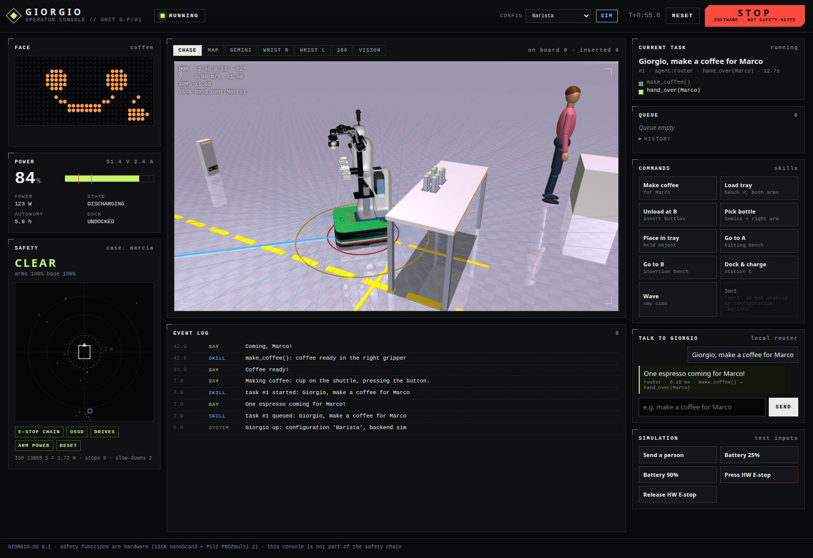
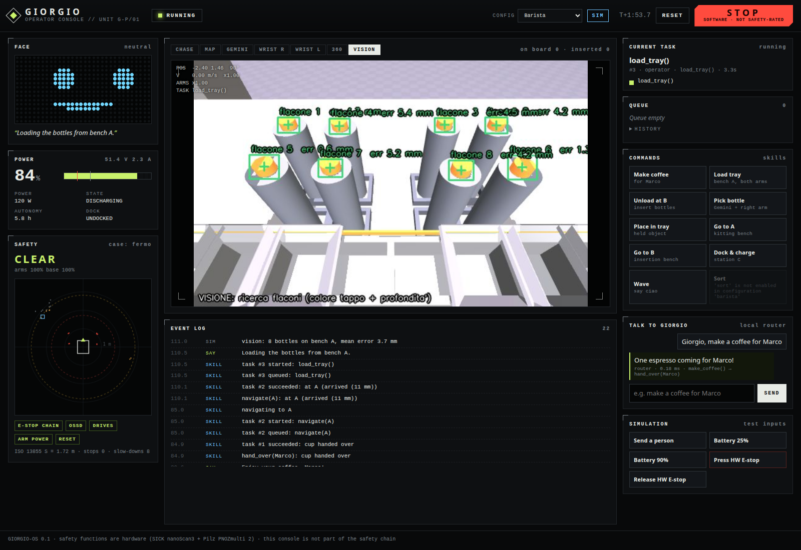
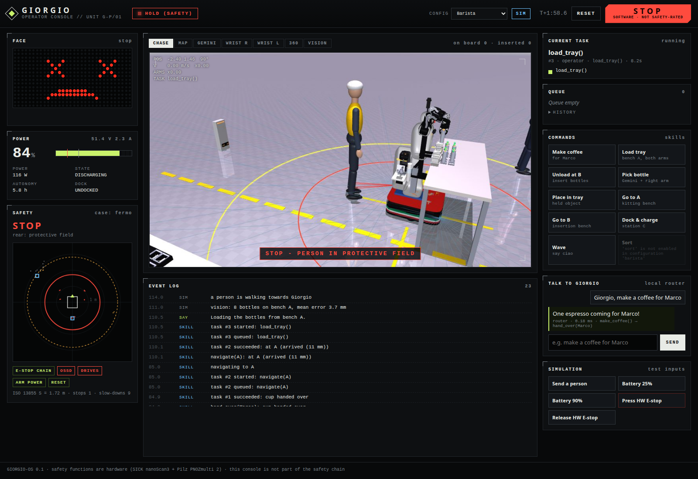

# giorgio_os

This is the unified software stack for **Giorgio**, the mobile bimanual service robot. It is a typed Python 3.10+ package and is built to run in two places from the same code:

- on the real robot (ROS 2 Humble/Jazzy on a Jetson AGX Orin);
- against the existing MuJoCo simulation in `../giorgio_v5.py`.

It covers the hardware layer (HAL), skills, the mission manager, the safety supervisor, the energy manager, a natural-language agent, YAML configurations and an operator web console.

- Architecture, with a diagram and an API table: [ARCHITECTURE.md](ARCHITECTURE.md)
- Software access per component and recommended part swaps: [../FEASIBILITY.md](../FEASIBILITY.md)


## Run it

```bash
# one-time, from the repository root: creates .venv with requirements.txt, installs giorgio_os, fetches third_party/
make setup                     # = scripts/setup.sh

# operator console + simulated Giorgio (from the repository root)
make console                   # = MUJOCO_GL=egl python -m giorgio_os.sim_server  -> http://127.0.0.1:8080
#   options: --config barista|logistics|dexterous|lowcost   --speed 2 (sim speed)   --soc 0.25   --no-humans   --port 8080

# tests (headless, ~40 s)
make test                      # = cd giorgio_os && MUJOCO_GL=egl python -m pytest
```

Things to try in the console:

- Type `make a coffee for Marco` in the chat. Giorgio brews with the backpack machine, drives to Marco and hands over the cup.
- Press **Send a person** while it works. The arms freeze in the protective field (`hold (safety)`), then resume on their own once the person leaves.
- Press **Battery 25%**. When idle, Giorgio goes to the charging station by itself.
- Press **STOP**, then **RESET**. This is the software stop, and it is clearly labelled as *not safety-rated*.
- Switch to the **Logistics** configuration with the selector. Coffee skills grey out and `sort` appears.

### Screenshots

Made with headless Chromium against the live sim (`docs/screenshots/`):

| | |
|---|---|
|  Coffee being brewed (heater on: 1.5 kW on the power card) |  Driving to Marco: driving-case scanner fields |
|  Gemini 336L vision overlay while loading the tray |  Person in the protective field: arms and base held at 0 |

Phone layout: [docs/screenshots/05_mobile.png](docs/screenshots/05_mobile.png).

## What is real and what is a stub

| Part | Status |
|---|---|
| HAL interfaces (`hal/interfaces.py`) | **done**: one driver per device + planner / perception / world / choreography services |
| **sim** backend (`hal/sim`) | **done**: wraps giorgio_v5 physics, IK, clash-aware planner, Gemini vision, people, energy model, docking |
| **real** backend (`hal/real`) | **stubs**: build fine with no hardware; every method raises `NotBroughtUp` and names the SDK/topic it will use |
| Safety supervisor (SSM, software layer) | **done** and tested; the safety-rated chain is hardware (nanoScan3 → PNOZ) |
| Energy manager (auto-charge, critical abort, coffee guard) | **done** and tested |
| Mission manager (priority queue, software stop, energy guards) | **done** |
| Skills `navigate`, `dock_charge`, `pick`, `place`, `sort`, `wave`, `say` | **done** on HAL primitives only, so they will run on the real robot once the drivers exist |
| Skills `load_tray`, `unload_tray`, `make_coffee`, `hand_over` | **sim only**: run v5's proven choreographies; reported *unavailable* on the real backend until rebuilt from primitives |
| Agent: local router (EN/IT) | **done** |
| Agent: Claude planner | **implemented, OFF by default, untested against the live API** (`agent.llm_enabled: true` + `pip install anthropic` + API key) |
| Operator console + REST API | **done** |
| Configs barista / logistics / dexterous / lowcost | **done**. The `dexterous` config loads the ORCA + AmazingHand models in sim, but scripted grasping is disabled because those hands need a learned policy (`../rl_mani`) |
| ROS 2 node / launch files | **not yet**: roadmap step 1 |

### Tests

There are 29 tests and all pass: `pytest` → `29 passed` in ~40 s on this machine.

| File | What it checks |
|---|---|
| `test_units.py` (13) | ISO 13855 distance; supervisor zones, hysteresis, fail-safe on stale/missing data, relay E-stop, software-stop latch and reset refusal; energy policy; EN/IT router; all configs load with the LLM off |
| `test_real_backend.py` (3) | the real HAL builds without hardware and names its SDKs; choreographed skills are refused on real; configs gate skills |
| `test_sim_skills.py` (5) | **pick-and-place** into the tray (vision → IK → grasp → place); **dock-and-charge** triggered by the energy manager at 25% SoC (contacts closed, SoC rising); **safety**: a person walks into the protective field during pick & place, arms and base go to 0, the joints do not move, then the task resumes and completes; software stop/reset; chat → navigation to B within 10 cm |
| `test_api.py` (8) | index/static, health/status, configs, task submit/validate/complete, chat (router + LLM-off fallback), camera JPEG, software stop/reset endpoint, sim inputs and validation |

### Known limitations

- The Gemini overlay labels (`flacone`, `VISIONE: ...`) come from v5's `Vision.render_overlay` and are still in Italian. Event-log and speech strings are translated.
- On the sim backend, `load_tray`, `unload_tray`, `make_coffee` and `hand_over` are v5 choreographies, so they can't be interrupted half-way as cleanly as the primitives. Cancelling stops the base and the arms and resets coffee mode.
- The sim runs at about 1.6x real time on this machine (the console paces it to 1x). Planning a pick takes about 50 ms of wall time.
- At interpreter exit, MuJoCo/EGL may print `EGL_NOT_INITIALIZED` tear-down warnings. They are harmless.
- The Claude planner has not been exercised against the live API: no key is used in tests and `GIORGIO_OFFLINE=1` is set.

## Changes that would help in `giorgio_v5.py` (not made; the adapter works around them)

The rule was not to modify existing files, so `hal/sim/engine.py` executes v5's source up to the `# ---- uscite` marker, plus the `draw()` function. These small changes upstream would let the adapter use a plain `import`:

1. Move `argparse` and the top-level scene build into a `build_world(args)` function, and guard the main loop with `if __name__ == "__main__":`.
2. Pass `log`, `ag_say` and `system2` in as callbacks instead of using module globals. `system2` shells out to the `claude` CLI; the adapter replaces it with a stub.
3. Split `control_step` into `sense()` / `act(k_arm, k_base)` so the speed scaling can be injected. Today the adapter re-implements `control_step` (about 40 lines) in `SimEngine._physics_step`.
4. Throttle `place_people()` (17 `Rotation.from_matrix` per person per 2 ms step). The adapter calls it at 100 Hz, which makes the sim about 3x faster (≈1.6x real time instead of ≈0.5x).
5. Keep user-facing strings in one table so they can be localised. The adapter translates the Italian `ag_say`/`log` strings to English with regexes.

If the `# ---- uscite` marker or the names the adapter uses (`arms`, `BAT`, `FIELDS`, `Skill`, `route_pose`, `drive_step`, `vision`, …) change, `load_v5_namespace` fails loudly at start-up.

## Roadmap to the first hardware bring-up

Each step ends with a test that can be run on the bench. The real drivers replace the stubs one at a time; everything above the HAL stays as it is.

1. **ROS 2 skeleton (week 1).**
   - Jetson AGX Orin, JetPack 6.2, ROS 2 Humble (OpenArm's stable distro).
   - Implement `RosBridge` (rclpy node + executor thread).
   - Add a `giorgio_os_node` entry point that runs `GiorgioRuntime(backend="real")` at 50 Hz.
   - Add a launch file and a systemd unit.
   - Console reachable on the robot's Wi-Fi.
2. **Safety hardware first (week 1–2).**
   - Wire the nanoScan3 OSSDs, E-stop and contactors to the PNOZ; write and sign the PNOZ program and the Safety Designer field sets.
   - Then implement `PnozRelay` (opto inputs on GPIO, later Modbus TCP) and `NanoScan3` (`sick_safetyscanners2` topics → `ScanFrame`).
   - Bench test: walk into the fields and check the supervisor's zone matches the OSSD LEDs, and that stale data stops the robot.
3. **Base (week 2).**
   - `TracerBase` (tracer_ros2 on CAN0, `/cmd_vel` through twist_mux and a speed-scale filter).
   - Nav2 with a map from the scanners. Then `navigate`, open floor first.
   - Check that the warning and protective fields slow and stop the base through both paths: software scale and PNOZ.
4. **Power and docking (week 3).**
   - 48 V pack with a CAN BMS → `CanBms`; build the dock; `NavDock` on opennav_docking.
   - Repeat the sim's `docktest` (10/10 docks) on the real floor.
   - Turn on the energy manager.
5. **One arm, then two (week 3–5).**
   - `OpenArm` + `OpenArmGripper` via openarm_ros2 (one CAN-FD bus per arm). Gravity compensation and torque limits first.
   - `MoveItPlanner` with the bimanual MoveIt config, then `OrbbecCamera` + `RealPerception` (port v5's HSV + depth pipeline).
   - Goal: `pick` / `place` pass the same assertions as `test_sim_skills.py`, using real detections.
   - Validate the Cat-1 stop sequence (CAN stop → contactor cut) with the arms in a stowed pose.
6. **Face and coffee module (week 5–6).**
   - ESP32-S3 HUB75 firmware + `Hub75Face`.
   - RP2040/micro-ROS shuttle + brew relay + `CoffeeMcu`.
   - Rebuild `make_coffee` from primitives (pick cup → place on shuttle → press → shuttle in → brew → shuttle out → pick). Its choreography flag then goes away.
7. **Hand-over and HRI (week 6+).** `hand_over` with force sensing (motor currents) for the release, people tracking from scanner + Gemini, and a decision on the 360° camera (see FEASIBILITY: UVC fisheye recommended).

Before step 5, freeze the risk assessment (EN ISO 12100) and the safety concept in `../docs/alimentazione_e_certificazione.md`. Nothing in this repository is a safety function.

## Layout

```
giorgio_os/
  ARCHITECTURE.md  README.md  pyproject.toml
  giorgio_os/
    types.py config.py runtime.py sim_server.py
    configs/{barista,logistics,dexterous,lowcost}.yaml
    hal/interfaces.py  hal/sim/{engine,drivers,services}.py  hal/real/drivers.py
    safety/supervisor.py  energy/manager.py  mission/manager.py
    skills/{base,library}.py  agent/agent.py  api/app.py  ui/static/{index.html,app.js,style.css}
  tests/  docs/screenshots/
```
