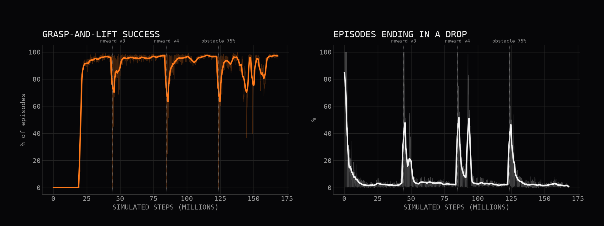
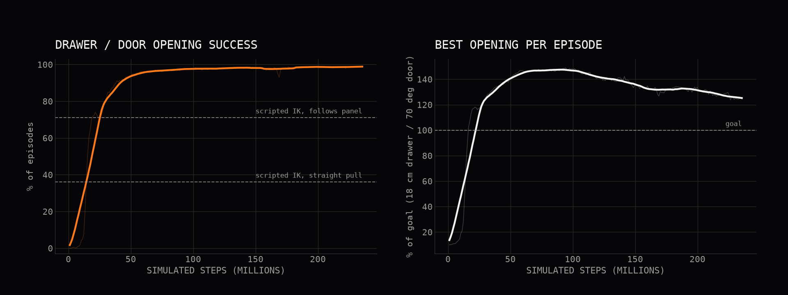

# rl_openarm — a policy trained for a plain OpenArm 2.0, run unchanged on Giorgio

**Claim we wanted to test:** Giorgio "uses the OpenArm 2.0 stack". So a controller trained for a plain, standalone
OpenArm 2.0 should run on Giorgio's right arm without being retrained. We trained one reinforcement-learning policy on the
standalone arm. Then we ran the same weights on Giorgio, with the same observation and action code.

Everything is in simulation (MuJoCo). Nothing here has run on hardware.

## TL;DR

We trained one policy on the standalone OpenArm 2.0: grasp a cube placed at a random spot on a table and lift it by 10 cm.
It uses PPO on mujoco_warp and the official Enactic MJCF and gripper. Observations are taken in the arm base frame, and
the actions are joint position targets. Then we ran **the same weights, unchanged**, on Giorgio's right arm at Giorgio's
bench.

All results below are 100 randomized episodes each, with noise and latency on:

| policy | standalone OpenArm 2.0 | Giorgio (as built, with its front buffer tray) | Giorgio without the tray |
|---|---|---|---|
| **delivered (v5), current Giorgio (AgileX Ranger Mini 3.0 base, 2026-10-03)** | **99 %** (seed 2: 100 %) | **89 %** (seed 2: 92 %) | **99 %** |
| delivered (v5), previous base (Tracer) | same | 91 % (seed 2: 90 %) | 99 % (seed 2: 97 %) |
| first version (v1) | 99 % | **18 %** | 93 % |

Notes on the table:
- "seed 2" is a second, independent batch of 100 episodes (`--seed 1` in `run_cpu.py`; the JSON files end in `_seed1`).
- Gravity compensation, joint offsets, signs and actuator gains did **not** need any mapping fix. Giorgio attaches the very
  same MJCF, and the policy's interface (the arm base frame) hides where the arm is mounted.
- The real transfer problem was **scene geometry the policy had learned to exploit**:
  - v1 rested its wrist on the table edge, which sits at a different place on Giorgio;
  - v1 also knew nothing about Giorgio's front buffer tray, which sits just in front of the torso.
- The fix was more randomization **in the standalone training scene**: table edge position, plus a low obstacle in front
  of the base. It also adds a penalty for touching the table with the arm links. There was **no training on Giorgio**.
- Of the remaining 9–10 % failures on Giorgio, 13 of 19 are cubes within 6 cm of the tray, which the policy cannot see.

## 1. Is there a pretrained OpenArm policy we could use instead? (checked 2026-10-03, WebFetch only)

| what | URL | usable here? |
|---|---|---|
| Enactic ACT policy, OpenArm 2 *cell* "pick up cube", MuJoCo (LeRobot, ~197 MB, Apache-2.0) | https://huggingface.co/enactic/act-openarm-2-cell-pick_up_cube_mujoco | **No.** It is bimanual (16-dim state/action) and needs 5 RGB cameras placed as in the Enactic cell (ceiling, head L/R, wrist L/R). Giorgio keeps the two official wrist cameras, but it has no ceiling or head cameras in those positions; its chest Gemini 336L sees the bench from elsewhere. |
| Enactic teleop dataset for the same task (LeRobot v3, 30 episodes, 5,405 frames, Apache-2.0) | https://huggingface.co/datasets/enactic/openarm-2-cell-pick_up_cube_mujoco-lerobot | It is data, not a policy. It would be the starting point for an image-based variant (section 4). |
| Official MJCF (what we use) | https://github.com/enactic/openarm_mujoco | Models and scenes only. No policies, no gym envs. |
| Isaac Lab tasks: Reach / Lift / Drawer for a single arm | https://github.com/enactic/openarm_isaac_lab | Reward and observation code exists, but **no checkpoints**, and it targets Isaac Sim, not MuJoCo. |
| LeRobot OpenArm support | https://huggingface.co/docs/lerobot/openarm | Real-hardware drivers only (follower/leader, bimanual). No sim env, no pretrained policy. |
| Community "openarm-rl-best-policy" (PPO, MuJoCo) | https://huggingface.co/qualia-robotics/openarm-rl-best-policy | The repo has only a README. There are **no weights**. |
| Community SmolVLA / ACT fine-tunes on the Enactic cell data | e.g. https://huggingface.co/xXFiEsTaDeAmOnXx/smolvla-openarmv2-cell | All of them are vision-based and bimanual. |

**Verdict:** we found no downloadable policy for a single OpenArm 2.0 arm that runs in MuJoCo from state observations.
So we trained our own (sections 2–3). docs.openarm.dev was only partly checked: its navigation has no learning or simulation
section.

## 2. The policy (trained only on the standalone OpenArm 2.0)

**Robot model.** This is the official Enactic MJCF `third_party/openarm_mujoco/v2/openarm_bimanual.xml`. We remove the
left arm (`scene.py::_openarm_right_only`) and keep the right arm with its official gripper, joint limits, Damiao motor
classes and position actuators (`right_joint1..7_ctrl`, `right_finger1_ctrl`). The model has no gravity compensation,
exactly like the official file. The arm base is fixed on a column in front of a table. No Giorgio part is in this scene.

**Task.** A cube (4–6 cm) is placed at a random spot on the table. The arm must grasp it and lift it.
**Success** means all of the following, within a 6 s episode:
- the cube is at least **10 cm** above where it started;
- it is within 5 cm of the gripper centre;
- this holds for at least **1 s without interruption**.

**Everything the policy sees or commands is expressed in the arm base frame.** That frame is the body
`openarm_right_base_link`, the root of the right-arm chain. It has the same name in both models.

| | content |
|---|---|
| observation (43) | arm joint positions (7) and velocities (7) · gripper position (1) · current joint/gripper targets (8) · gripper centre from forward kinematics (3) · **cube position (3)** · cube minus gripper (3) · lift goal minus cube (3) · last action (8) |
| action (8) | 7 increments of the joint **position targets** (±0.05 rad per step, 25 Hz) + 1 gripper command (open → squeeze) |
| frequency | policy at 25 Hz; physics at 500 Hz (dt 2 ms, implicitfast, elliptic cones, impratio 10, as in Giorgio) |

The cube position is the only "exteroceptive" input. On the robot it is what Giorgio's Gemini 336L pipeline already
outputs (section 4). In training it is corrupted on purpose:
- a constant per-episode bias of ±5 mm (calibration error);
- noise with σ = 3 mm;
- a **latency of 0–3 control steps (0–120 ms)**.

The joint readings are also handled:
- they get noise;
- they have 0–1 step of latency;
- in 30 % of episodes the action is applied one step late.

**Domain randomization** (new values at every reset, per environment):
- cube: size 4–6 cm, mass 30–250 g, friction 0.5–1.2, yaw, position;
- actuators: kp and kv ×0.8–1.2 per actuator, joint damping ×0.7–1.3;
- **gravity compensation** of the arm links: anywhere from 0 to 100 %;
- table height relative to the arm base: −0.40 … −0.32 m;
- from v2 on: the table's front-edge position, and a low obstacle in front of the base (see section 3).

**Training.**
- Algorithm: PPO on **mujoco_warp** with 4,096 parallel environments, on one RTX 5070 (≈ 1.3 GB VRAM).
- Speed: ≈ 78k control steps/s, which is 1.6 M physics steps/s.
- Implementation: the PPO code is reused from `rl_mani`.
- Networks: actor and critic are each an MLP 512-256-128.
- Curve: see the learning-curve figure. The dotted lines mark where training was resumed with a modified reward (v3, v4) or more frequent obstacles (v5).

| phase | what changed | steps | wall time | log |
|---|---|---|---|---|
| v1 (`runs/r1`) | base task, no table-edge or obstacle randomization | 78.6 M (it. 800) | 35 min | `runs/r1/log.csv` |
| v2 (`runs/r2`, from scratch) | + random table front edge (0–0.20 m from the base), + low obstacle in front of the base (50 % of episodes, 4–11 cm high), + penalty −1.5/step when an arm link (not the fingers) touches the table or any arm part touches the obstacle | 44.2 M | 17 min | `runs/r2/log.csv` (first 450 it.) |
| v3 (`runs/r3`, resumed) | v2 lifted the cube to ~50 cm and kept it there. Reward now drops above 16 cm (−8/m) and the goal term is wider | +40.4 M | 22 min | `runs/r3/log.csv` |
| v4 (`runs/r4`, resumed) | stronger overshoot penalty (−25/m): peak lift falls from ~45 cm to ~20 cm | +38.9 M | 18 min | `runs/r4/log.csv` |
| **v5** (`runs/r5`, resumed) = **delivered** | obstacle present in 75 % of episodes instead of 50 % (v4 had lost some robustness to the tray) | +44.4 M | 15 min | `runs/r5/log.csv` |

The delivered policy saw 168 M simulated control steps in 72 min of training. The dips in the curve right after each
resume are partly an artifact: all 4,096 environments restart together, so for a while the only episodes that finish are
failures. The same thing happens at the very start.



## 3. Transfer test: the same weights on Giorgio

`run_cpu.py` runs the policy in standard MuJoCo on the CPU. It uses the **same** observation and action code
(`policy_io.py`) on two robots:
- **standalone:** the scene above;
- **Giorgio:** built with `giorgio_model.build(hands="gripper", base="amr", fixed_base=True)`. It is the full robot: torso,
  lift column, AMR, left arm, shells and the front buffer tray. The cube sits on the same bench "B" as in `giorgio_v5.py`
  (top at 0.90 m).

The base frame is read from the simulator at every step. On the real robot this would be the TF lookup
`base_link → openarm_right_base_link`. No joint offsets, sign flips or gain changes were needed. The joint names, zero
positions and actuators are identical, because Giorgio attaches the very same MJCF.

What actually differs between the two scenes:

| | standalone OpenArm | Giorgio |
|---|---|---|
| gravity compensation | none (official MJCF) | 100 %, motor-side (`actgravcomp`, counted against the motor torque limits) |
| table under the cube, relative to the arm base | 0.36 m below | 0.378 m below (bench at 0.90 m, shoulders at 1.278 m) |
| table front edge, relative to the arm base | 0.08 m in front | 0.16 m in front |
| obstacles | none | Giorgio's front **buffer tray** (x 0.15–0.23 m, ~10 cm above the bench), torso, left arm |
| base | rigid | the torso rides on the lift column (slightly compliant) |

Every evaluation runs 100 episodes with all of the randomization, noise and latency above. The cube is placed in the
same region of the arm base frame on both robots. 95 % Wilson intervals are given in brackets.

Success rate:

| policy | standalone OpenArm 2.0 | Giorgio as built (with front tray) | Giorgio, tray removed | notes |
|---|---|---|---|---|
| untrained (initial weights) | 0 % [0–7] (50 ep.) | — | — | |
| v1 | 99 % [94.6–99.8] | **18 %** [11.7–26.7] | 93 % [86.3–96.6] | leans its wrist on the table |
| v2 | 97 % [91.5–99.0] | 84 % [75.6–89.9] | 95 % [88.8–97.8] | lifts the cube to ~40 cm |
| v3 | 97 % / 99 % | 84 % / 85 % | 97 % [91.5–99.0] | transient swing up to ~45 cm |
| v4 | 98 % / 97 % | 78 % / 66 % | 98 % [93.0–99.4] | natural motion, less robust to the tray |
| **v5 (delivered)** | **99 % [94.6–99.8] / 100 % [96.3–100]** | **91 % [83.8–95.2] / 90 % [82.6–94.5]** | **99 % [94.6–99.8] / 97 % [91.5–99.0]** | |
| v5, nominal (no randomization/noise/latency, 50 ep.) | 100 % [92.9–100] | 90 % [78.6–95.7] | — | |
| **v5 on the current Giorgio (Ranger Mini 3.0 base)** | (unchanged) | **89 % [81.4–93.7] / 92 % [85.0–95.9]** | **99 % [94.6–99.8]** | no retraining |
| v5 on the current Giorgio, nominal (50 ep.) | — | 94 % [83.8–97.9] | — | |

All rows above the "current Giorgio" rows were measured on the **previous base** (AgileX Tracer, before 2026-10-03).
The Giorgio model was then updated:
- base: AgileX Ranger Mini 3.0, driven as a kinematic mocap target when mobile; fixed in this test;
- also new: deck cover, fixed column, scanner pods, coffee module on the 0.69 m shelf;
- unchanged: arms, torso, 1.278 m shoulder height, bench and front tray.

We re-ran v5 on it **without retraining**, and `scene.py` needed no change. The result is within the statistical noise of
the previous base: 89 % and 92 % now against 91 % and 90 % before, with overlapping intervals. Files:
`valutazione/v5_rangermini_*.json`. `giorgio_transfer.mp4` and `.pkl` were regenerated on the current model.

"a / b" = two independent batches of 100 episodes (seeds 0 and 1).

How the delivered policy moves:

| | standalone | Giorgio (with tray) |
|---|---|---|
| mean peak lift | 15.4 cm | 17.0 cm |
| mean time to success (includes the 1 s hold) | 1.72 s | 2.22 s |

Every number comes from `valutazione/v*_*.json`.

### What went wrong first, and how we found it

1. **First result (v1):**
   - standalone: 99 %;
   - Giorgio without its tray: 93 %;
   - Giorgio as built: **18 %**.
2. **Isolating the factors.** We used the it.-450 checkpoint of v1 and ran 50 episodes per variant, with the same seeds.
   - **Gravity compensation does not matter.** Giorgio scored 72–74 % with gravity compensation motor-side (as built) or
     removed. At an earlier checkpoint, motor-side, passive and removed all gave the same 63 %. The standalone arm scored 94–98 % with no compensation and with Giorgio-style motor-side compensation. We had
     randomized it 0–100 % in training anyway.
   - **Table height does not matter.** The standalone arm with the table at Giorgio's height scored 96 %.
   - **Table edge position explains the whole gap.** Moving only the standalone table's front edge from 0.08 m to Giorgio's
     0.16 m dropped success to 74 %, the same as on Giorgio.
   - A step-by-step trace confirmed it. With Giorgio's gravity compensation switched off, the two robots stay within
     ~1e-3 rad of each other for the first ~10 control steps. They diverge exactly when the policy's link5/link6 start
     resting on the standalone table during the lift. On Giorgio
     there is no table at that spot, so the arm takes a different posture, hits joint limits (j2 at −0.17 rad, j6 at
     +0.79 rad) and stops at 8–9 cm.
   - For the final v1 weights: standalone with table edge 0.16 m and table height −0.378 m scored 93 %, the same as Giorgio
     without the tray.
3. **The tray.** Contact logging on Giorgio as built showed the gripper and forearm repeatedly hitting the tray's walls
   and chamfers (`tray_ch*`). The policy had never seen anything between the base and the cube.
4. **Fix: generic randomization of the standalone scene, not Giorgio-specific training.**
   - The table's front edge moves 0–0.20 m.
   - A low box obstacle 4–11 cm high stands somewhere 0.085–0.235 m in front of the base. The policy cannot see it.
   - A penalty applies when an arm link (not the fingers) touches the table or anything touches the obstacle.
   - The observation and action mapping was not touched. It was already correct: the trace above shows identical behaviour
     once the scene is the same.
5. **Reward shaping.** v2–v4 only fixed motion quality: lifting to 50 cm, then a swing-up. v5 just made the obstacle more
   frequent.
6. **Remaining failures (v5 on Giorgio as built).** 13 of the 19 failures (both seeds) are cubes 0.25–0.29 m from the
   base, i.e. 2–6 cm from the tray wall. There the fingers or forearm still catch the tray. Giorgio's own scripted pipeline avoids this zone (its objects
   sit at x ≥ 0.30 m).

## 4. Does it need vision? What changes compared with a "normal" vision system?

Yes, it needs vision, but only to answer *where is the cube*. The question is which part of the pipeline the learned policy
replaces. There are three levels:

1. **Classical pipeline (Giorgio today, `giorgio_v5.py` / `giorgio_sort.py`).**
   - The Gemini 336L gives colour and depth.
   - Colour segmentation plus the depth of the top face give the object pose.
   - A hand-written planner chooses the approach and grasp poses.
   - IK turns them into joint targets, and the joints follow a scripted trajectory.

   Every step is explicit and debuggable. But each new object or situation needs new code: grasp heuristics, approach
   directions, recovery when the object moves.
2. **Learned policy on state (what we did here).**
   - The vision part is **unchanged**: the Gemini still outputs the cube position, now expressed in the arm base frame.
   - The *planner + IK + scripted trajectory* are replaced by the policy. It closes the loop at 25 Hz, from joint states and
     the cube position directly to joint targets.

   This is why we randomized what vision really delivers: noise, a calibration bias and 0–120 ms latency. Nothing about the
   camera itself changes: same sensor, same segmentation. The interface is the same three numbers per object that the
   classical pipeline already computes.

   Limits:
   - the policy only knows the cube's *position*, not its shape or orientation;
   - it does not know about obstacles it was not trained with;
   - it needs a fresh pose estimate while it moves, so the arm must not hide the cube from the chest camera. A wrist
     camera helps here.
3. **End-to-end visuomotor policy (images in, actions out).** Examples: ACT or Diffusion Policy in LeRobot, or VLA models
   such as SmolVLA / pi0. The policy gets camera images (chest Gemini and/or the wrist cameras) plus joint states, and
   learns perception and control together.

   What it needs:
   - **demonstrations:** typically 50–200 teleoperated episodes per task. The OpenArm leader arms or VR teleop are
     supported by LeRobot. Enactic's cell dataset above has 30 episodes, recorded in MuJoCo.
   - **the same camera placement at training and deployment time**, or heavy randomization of viewpoint, lighting,
     textures and object appearance if it is trained in sim.
   - much more compute per decision.

   What it gives:
   - no hand-written segmentation;
   - it can handle objects with no clean colour or depth cue (transparent, deformable, cluttered).

   Transfer is harder. A policy trained in the Enactic cell sees the cell's cameras and background. On Giorgio the cameras
   are elsewhere, so it would have to be fine-tuned on Giorgio data. Our state-based policy transferred **because** its
   interface (joint states + object position in the arm base frame) does not depend on where the cameras are.

**What an image-based version of this demo would need (plan, not done):**
1. Render the Gemini 336L view (`gemini` camera in Giorgio's model) and the wrist camera during PPO rollouts (MuJoCo
   offscreen, or mujoco_warp batch rendering), with randomized light, bench texture and cube colour.
2. Distil the state policy into an image policy (teacher–student, DAgger): the student gets images + joint states, and the
   teacher supplies the action labels. This avoids collecting teleop data for a task we can already solve with privileged
   state.
3. Alternatively, record ~100 teleop demonstrations on Giorgio, or use our state policy as an automatic demonstrator, and
   train ACT or Diffusion Policy with LeRobot.

Either way, the camera placement used for training must be Giorgio's own. This is the main reason an off-the-shelf OpenArm
visuomotor checkpoint (the Enactic ACT model above) is not "plug and play" on Giorgio, while a state-based one is.

## 5. Files

| file | what it is |
|---|---|
| `scene.py` | builds the standalone OpenArm scene (official MJCF, right arm + gripper) and the Giorgio scene (giorgio_model.build + bench B + cube) |
| `policy_io.py` | the policy interface: constants, observation builder, gripper mapping (shared by GPU training and CPU runs) |
| `env_openarm.py` | vectorized GPU environment (mujoco_warp + torch): reward, randomization, latency |
| `train.py` | PPO (from rl_mani, adapted) |
| `run_cpu.py` | runs the policy unchanged on `--robot openarm` or `--robot giorgio`: evaluation (JSON), video (1920x1080, 30 fps, no overlays), Giorgio-format recording (`.pkl`) |
| `grafico.py` | learning curve (dark style) |
| `check_scene.py` | gripper geometry and forward-kinematics checks |
| `politica_openarm_lift.pt` | **delivered policy** (v5 = `runs/r5/modello.pt`) |
| `politica_openarm_lift_v1.pt`, `_v2.pt`, `_v3.pt` , `_v4.pt` | earlier versions, kept for the comparison in section 3 |
| `valutazione/*.json` | every evaluation: settings, success rate, Wilson interval, per-episode detail |
| `runs/r1..r5/` | training logs (CSV) and checkpoints |
| `learning_curve_dark.png` | learning curve |
| `openarm_standalone.mp4` | the delivered policy on the standalone OpenArm 2.0 (10 s, several episodes) |
| `giorgio_transfer.mp4` | the same weights on Giorgio's right arm, at the bench (10 s, light background; current Ranger Mini 3.0 model, front tray present) |
| `giorgio_transfer.pkl` | the same Giorgio run in the `giorgio_v5.py --record` format (geoms + per-frame xpos/xquat at 30 fps). Convert with `render/to_npz.py` for Blender. |

## 6. How to rerun

```bash
PY=${PYTHON:-python}   # training env from requirements-train.txt (mujoco 3.5, mujoco_warp, warp 1.12, torch CUDA)
cd rl_openarm
$PY env_openarm.py 4096                                      # benchmark
$PY train.py --envs 4096 --max_minutes 50 --out runs/rX     # current reward (v4/v5 coefficients); NOT tested from scratch: the delivered policy came from the staged runs r2→r5
P_OBST=0.75 $PY train.py --envs 4096 --max_minutes 15 --out runs/rY --resume runs/rX/modello.pt   # as in v5
$PY run_cpu.py eval --robot openarm --n 100 --json valutazione/a.json
$PY run_cpu.py eval --robot giorgio --n 100 --json valutazione/b.json      # add --no_buffer to remove Giorgio's front tray
MUJOCO_GL=egl $PY run_cpu.py video --robot openarm --seconds 10 --out openarm_standalone.mp4
MUJOCO_GL=egl $PY run_cpu.py video --robot giorgio --seconds 10 --out giorgio_transfer.mp4 --record giorgio_transfer.pkl
$PY grafico.py learning_curve_dark.png runs/r2/log.csv:450 runs/r3/log.csv runs/r4/log.csv runs/r5/log.csv
```
The reward coefficients were changed between phases (v2 → v3 → v4). `env_openarm.py` contains the last version. The
earlier values are noted in the code comments and in section 3.

## 7. Limits (honest list)

- **Simulation only.** The contact model, gripper pads and actuators are the official MJCF's idealised position servos.
  The real Damiao motors, CAN latency and gripper compliance have not been identified.
- **Privileged geometry.** The policy gets the cube *position*. In sim that comes from the simulator plus artificial
  noise, bias and latency, not from a rendered depth image run through Giorgio's actual segmentation code.
- **One object type** (a cube 4–6 cm). The policy has no knowledge of orientation or shape beyond what it learned for cubes.
- **Obstacles are invisible to the policy.** It learned to keep its links away from a randomized low obstacle near the
  base, but it does not *see* obstacles. Clutter or a different fixture would need training or an obstacle input.
- **Motion quality.** The policy is fast: the cube is above 10 cm about 0.7–1.2 s after the start. Grasps are
  sometimes not top-down, because the cube can be pinched at an angle. Occasionally (e.g. episode 2 of
  `giorgio_transfer.mp4`) it swings the cube higher, up to ~40 cm, before settling at 12 cm. On a real arm, speed and jerk
  limits and a smoother action filter should be added before deployment.
- The success threshold (10 cm, held 1 s) and the 6 s episode are our choice. Per-episode lift heights are in the JSONs.

## 8. Second skill: open a cabinet, drawer OR hinged door (added 2026-10-04)

**Why this task.** Grasp-and-lift a cube does not need learning: a scripted IK grasp solves it. We first tried
"open a drawer by its handle" and measured a scripted IK baseline on the same randomization **before** training:
it scored **95 %** (`valutazione/drawer_only_scripted_openarm.json`). So a drawer alone is not a good RL example either.
The task we kept is **"open the cabinet"**: the compartment is closed by a drawer, or by a door hinged on the left or
on the right. **The controller is not told which.** It gets only what a camera gives: the handle point, the
front-panel normal, and the handle type and size. A drawer must be pulled straight. A door must be pulled along an arc
whose centre is unknown, and the grasp has to survive the wrist rotation as the door turns. All of this happens
under friction, damping, springs and masses the controller cannot see.

Everything is in simulation (MuJoCo). The same pipeline is used as for the lift policy: PPO on mujoco_warp on the
standalone OpenArm 2.0, observations in the arm base frame, joint-position-target actions, randomization in the
standalone scene only. The same weights then run unchanged on Giorgio. There was no training on Giorgio.

**Scene.** A benchtop cabinet: a target compartment with a 30 x 18 cm front, a fixed drawer above it and a solid base
below it.
- Mechanisms: drawer 50 %, door hinged left 25 %, door hinged right 25 %.
- Handles:
  - drawer: horizontal bar (8–16 cm), vertical bar (8–11 cm) or knob (Ø 2.4–4.4 cm);
  - door: vertical bar or knob, near the free edge;
  - all handles: bar radius 5–12 mm, standoff 2.5–4.5 cm, friction 0.4–1.0.

**Randomization (standalone only).**
- Cabinet pose: front 0.44–0.56 m in front of the arm base, lateral −0.20…0.05 m, yaw ±20°, compartment 0.12–0.26 m
  above the table.
- Table: height and front edge as in the lift task.
- Drawer: Coulomb friction 1–15 N, damping 2–40 N·s/m, mass 0.5–4 kg, closing spring 0–40 N/m (50 % of episodes),
  initial opening 0–5 cm.
- Door: friction 0.1–1.5 N·m, damping 0.1–2 N·m·s/rad, mass 0.6–2 kg, closing spring 0–1 N·m/rad (50 % of episodes),
  initial opening 0–8°.
- Arm: kp/kv, damping and gravity compensation as in the lift task.
- A low obstacle in front of the base in 50 % of episodes.
- Perception: handle point bias ±7.5 mm per axis, noise 3 mm, latency 0–120 ms; panel-normal yaw error ±3°;
  handle-size error ±2 mm.
- Proprioception and actions: joint noise and latency, and the action applied one step late in 30 % of episodes,
  as in the lift task.

**Success:** the drawer is open ≥ 15 cm, or the door ≥ 60°, held for ≥ 0.48 s, within a 10 s episode, starting from
the arm retracted.

**Policy interface** (`policy_io_cabinet.py`):
- Observation (58 values):
  - joints (7 + 7 + 1), current targets (8);
  - grasp point and gripper axes from forward kinematics (9);
  - handle point "from vision" and handle − grasp point (6);
  - panel normal (3), handle bar axis (3), handle size (3);
  - handle displacement since the start of the episode (3);
  - last action (8).
- Action (8): the same as the lift policy, i.e. 7 joint-target increments plus the gripper command, at 25 Hz.
- Reward: dense reach and align terms, plus opening progress, minus a penalty for arm-link contacts and for
  action rate.

**Training** (`runs/c1`, `train.py --task cabinet`): PPO, 4,096 environments, 236 M control steps, 95 min on the
RTX 5070. The delivered weights are the ones at iteration 2,400 (`politica_openarm_cabinet.pt`).



The training curve shows the success of the *stochastic* training rollouts. The dashed lines are the two scripted
baselines (deterministic, 100 evaluation episodes).

### Results (100 randomized episodes each, noise + latency on; 95 % Wilson interval)

The scripted controllers and the policy were run on **the same 100 episodes** (same seed, same cabinets, same dynamics,
same noise).

| controller | standalone OpenArm 2.0 | Giorgio as built (front tray) | drawers | doors |
|---|---|---|---|---|
| untrained policy (50 ep.) | 0 % [0–7] | — | 0/18 | 0/32 |
| policy, early checkpoint (it. 100, 10 M steps) | 1 % [0.2–5.4] | — | 0/38 | 1/62 |
| **scripted IK, straight pull** | **36 %** [27.3–45.8] | **52 %** [42.3–61.5] | 36/38 · 52/53 | **0/62 · 0/47** |
| **scripted IK, follows the panel normal** | **71 %** [61.5–79.0] | **76 %** [66.8–83.3] | 36/38 · 52/53 | 35/62 · 24/47 |
| **RL policy (delivered)**, seed 0 | **96 %** [90.2–98.4] | **90 %** [82.6–94.5] | 38/38 · 53/53 | 58/62 · 37/47 |
| RL policy, seed 1 | 99 % [94.6–99.8] | 95 % [88.8–97.8] | 43/43 · 43/43 | 56/57 · 52/57 |
| RL policy, Giorgio with the front tray removed | — | 100 % [96.3–100] | 53/53 | 47/47 |

In the "drawers" and "doors" columns, "a · b" means standalone · Giorgio.

How the scripted baselines work (`run_cabinet.py`, `--controller scripted | scripted_follow`):
- They get **exactly the policy's inputs**: the same perception noise, bias and latency, and the same action
  interface and rate limit.
- They use damped least-squares IK on the arm model.
- On the standalone arm, which has no gravity compensation, they add gravity feed-forward as a set-point offset.
  Without it the uncompensated servos sag 2–3 cm and the grasp misses.
- The motion:
  1. pre-grasp 10 cm in front of the perceived handle;
  2. approach;
  3. close the gripper;
  4. pull.
- `scripted` pulls straight along the perceived normal: the classic drawer opener.
- `scripted_follow` re-reads the handle and the normal at every step and keeps pulling along the *current* normal, with
  the gripper re-oriented to it. This is a hand-written way to follow a door's arc.
- The grasp depth was tuned on nominal episodes, so these are tuned baselines, not strawmen.

What the numbers say:
- **Drawers:** scripted IK is as good as RL (95–98 % vs 100 %). This is why a drawer alone was not a good RL example.
- **Doors:**
  - the straight pull never reaches 60° (0/109; mean best 37° standalone, 43° on Giorgio). The gripper slips off the handle while the door
    turns.
  - following the panel normal helps (55 %), but the grasp is often lost as the wrist turns.
  - the policy opens 94–98 % of the doors on the standalone arm, and 79–91 % on Giorgio as built. It learned to keep contact and re-grasp, and to
    push the door past 60° once it is ajar. It needs no articulation model, no hinge estimate and no per-mechanism code.
- **What RL buys here:** one learned controller handles an unknown articulation, with contact, and with dynamics it
  cannot see. A scripted controller would need an articulation estimator and recovery logic written by hand.
  A better hand-written door opener is certainly possible. We did not write one.

**Transfer to Giorgio.**
- How it was run:
  - `scene_cabinet.build_giorgio()` stands the same cabinet on bench B, in front of the right arm (front 0.50 m,
    compartment 0.20 m above the bench);
  - `giorgio_model.py` is not modified;
  - the evaluation randomizes the placement: front 0.46–0.54 m, lateral −0.18…−0.05 m, yaw ±15°, compartment
    0.16–0.24 m above the bench;
  - it also randomizes the handle, the dynamics and the noise, exactly as on the standalone arm.
- No mapping fix was needed: same weights, observations in the arm base frame.
- **All Giorgio failures are doors that stop at 49–58°.**
  - Contact logging shows the door, or the gripper holding it, hitting Giorgio's front buffer tray (`amr` body) and
    the parked left arm.
  - The cause is the low cabinet placements: the door bottom is only 7–15 cm above the bench, and the tray stands
    ~10 cm tall.
  - With the tray removed the policy scores 100 %.
  - On the real robot, the cabinet should sit higher than the tray, or the left arm should be stowed lower. The same
    limitation is listed for the lift policy (section 3, item 6).
- Mean time to success: 2.0–2.4 s on both robots, including the 0.48 s hold. Mean best opening: ~22 cm for drawers,
  ~75° for doors.

### Files (cabinet task)

| file | what it is |
|---|---|
| `scene_cabinet.py` | cabinet with the three mechanisms and the five handle geoms; standalone and Giorgio scenes |
| `policy_io_cabinet.py` | observation/action interface (shared by GPU and CPU) |
| `env_cabinet.py` | vectorized GPU environment: reward, randomization, latency |
| `run_cabinet.py` | CPU evaluation and video of the policy or of the scripted baselines (`--controller`), on `--robot openarm|giorgio` |
| `grafico_cabinet.py` | learning curve |
| `politica_openarm_cabinet.pt` | **delivered policy** (`runs/c1/modello.pt`, iteration 2,400) |
| `politica_openarm_cabinet_early_it100.pt` | early checkpoint (iteration 100), used for the "clumsy" video |
| `valutazione/cabinet_*.json` | all evaluations above, with per-episode details (`by_mechanism`, `by_handle`) |
| `learning_curve_cabinet_dark.png` | learning curve |
| `cabinet_standalone.mp4` | 10 s: the policy on the standalone arm (drawer with a horizontal bar, left-hinged door with a vertical bar, right-hinged door with a knob; the 3rd episode has the random low obstacle) |
| `cabinet_giorgio.mp4` | 10 s: the same weights on Giorgio (drawer, door with a vertical bar, door with a knob) |
| `cabinet_baseline_fail.mp4` | 9 s: the scripted straight-pull baseline on a left-hinged door; it pulls the door to ~44°, loses the handle, and the door swings back |
| `cabinet_early_training.mp4` | 10 s: the iteration-100 checkpoint reaches the handle but cannot open a drawer or a door |
| `scene_drawer.py`, `env_drawer.py`, `policy_io_drawer.py`, `run_drawer.py`, `runs/d1`, `runs/d2` | the drawer-only attempt. Not delivered: the scripted baseline already scores 95 %. The training runs were stopped early. |

How to rerun:
```bash
PY=${PYTHON:-python}   # training env (requirements-train.txt)
$PY train.py --task cabinet --envs 4096 --max_minutes 95 --out runs/cX
$PY run_cabinet.py eval --robot openarm --n 100 --json valutazione/a.json                     # policy (default weights)
$PY run_cabinet.py eval --robot giorgio --n 100 --json valutazione/b.json                     # add --no_buffer: no front tray
$PY run_cabinet.py eval --robot openarm --controller scripted_follow --n 100 --json valutazione/c.json
MUJOCO_GL=egl $PY run_cabinet.py video --robot giorgio --episodes 10:0,10:1,13:2 --ep_seconds 3.4 --out cabinet_giorgio.mp4
BASELINE=0.36,0.71 $PY grafico_cabinet.py learning_curve_cabinet_dark.png runs/c1/log.csv
```

**Limits.**
- Everything from section 7 applies here too.
- The policy relies on a handle detector and a panel-normal estimate. In sim these come from the simulator with
  artificial noise, not from rendered images.
- The doors are 30 cm wide and the drawers 30 cm wide. Larger doors need more reach.
- The mean best door opening is ~75°, sometimes up to 110°: the policy pushes doors wide open after the threshold.
- The fixtures are idealized: no latches, no magnetic catches, no stiction peaks beyond Coulomb friction.
